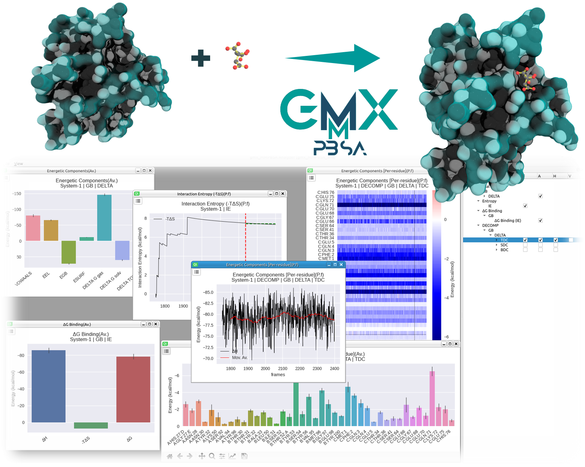

## What is xBFreE?
**xBFreE** [ **x** (any BFE method) **B**inding **Fre**e **E**nergy) is a robust tool to compute the Binding Free 
Energy (BFE) with multiples method for the most popular Molecular Dynamics Programs. xBFreE is not only the natural 
evolution of gmx_MMPBSA, but also an ambitious project to democratice any BFE method in easy-to-use and better way.

!!! note "Cite xBFreE"
    Coming soon!

    Please, consider also citing gmx_MMPBSA

    
    
    `gmx_MMPBSA` official paper has been published on _Journal of Chemical Theory and Computation_ and can be accessed 
    [here](https://pubs.acs.org/doi/10.1021/acs.jctc.1c00645). If you use `gmx_MMPBSA`, please cite it as follows:
    
    Valdés-Tresanco, M.S., Valdés-Tresanco, M.E., Valiente, P.A. and Moreno E. _gmx_MMPBSA: A New Tool to Perform 
    End-State Free Energy Calculations with GROMACS_. Journal of Chemical Theory and Computation, 2021 17 (10), 6281-6291. 
    https://pubs.acs.org/doi/10.1021/acs.jctc.1c00645. 
    
    Download | [*.bib](gmx_MMPBSA_citation.bib) | [*.ris](gmx_MMPBSA_citation.ris)

    Please, visit [Cite gmx_MMPBSA](cite_us.md#example) page for more information on how to cite gmx_MMPBSA and the 
    programs/methods implemented in it.

### Which MD programs are supported?
Currently, we support four (4) MD programs: 

| GROMACS |  AMBER  |  NAMD  |  CHARMM  |
|:-------:|:-------:|:------:|:--------:|
|  `gmx`  | `amber` | `namd` | `charmm` |

## **What can be done with xBFreE?**
Multiple calculations can be performed with **xBFreE** such as:

* At the moment only MMPBSA methodologies[^1] can be performed.

## **xBFreE** a quick overview
[**xBFreE**](howworks.md) is a python application that carries out several BFE calculations. The **xBFreE** results can 
be analyzed with [**xBFreE-Analyzer**](../analyzer.md) which provides an intuitive way to analyze the data through 
visually and well-structured charts and save high-quality pictures. You can test if your **xBFreE** installation 
work well using [**xBFreE-Tester**](../examples/gmx_MMPBSA_test.md#gmx_mmpbsa_test-command-line) by running one or more 
available [examples](../examples/README.md) in **xBFreE**.

## **Installation**
Ready to use **xBFreE** 😀? Check the [installation page](installation.md)

## **Need help?**
[Help](../Q&A/README.md) section contains the most frequently asked questions and errors. Also, look at our 
[Google group](https://groups.google.com/x/xbfree) or the [issues](https://github.com/xBFreEnergy/xBFreE/issues) 
section to find out about specific cases and others.

If you have any question, doubt, suggestion or want to talk about any theme, please, consider open a new 
[discussion](https://github.com/xBFreEnergy/xBFreE/discussions) 

## Follow **xBFreE**
Visit [Pypi Stats](https://pypistats.org/packages/**xBFreE**) or [PePy](https://pepy.tech/project/**xBFreE**)
to see how **xBFreE** is doing.

## **Collaboration**

We are opened to any collaboration.  If you want to implement any method developed by your Lab we can help you. Also,
if you are interested in including xBFreE in your divulgation program, we can help you to optimize the content and 
including it in our oficial documentation.

Feel free to contact us through our Google group (https://groups.google.com/x/xbfree) for more details...

## **Acknowledgments**
- First of all, to AMBER, GROMACS, NAMD and CHARM developers. Without their incredible and hard work, **xBFreE** would 
  not exist.
- To all researchers that help improving gmx_MMPBSA with comments, feedback, and bug reports.
- Jason Swails (Amber developer and [ParmEd](https://github.com/ParmEd/ParmEd) principal developer) for his continuous 
  support on ParmEd issues.
- Dr. Hymavathi Veeravarapu for helping with the introductory video for gmx_MMPBSA

[][11]

- To the Open Source license of the [JetBrains](https://www.jetbrains.com) programs.

[][12]

- To the [Sourcery](https://sourcery.ai/invite/gndRrjlo) team for supporting us 
  with the [Pro version](https://sourcery.ai/pro/).

  [11]: https://www.jetbrains.com/?from=gmx_MMPBSA
  [12]: https://sourcery.ai/?from=gmx_MMPBSA

---
We hope that **xBFreE** will help you

  [^1]: Methodologies implemented in gmx_MMPBSA and others new specifics for this program