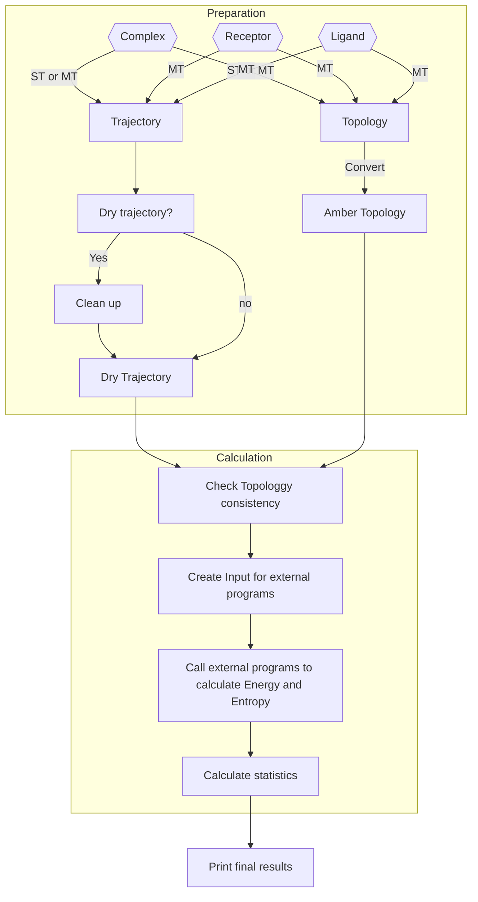
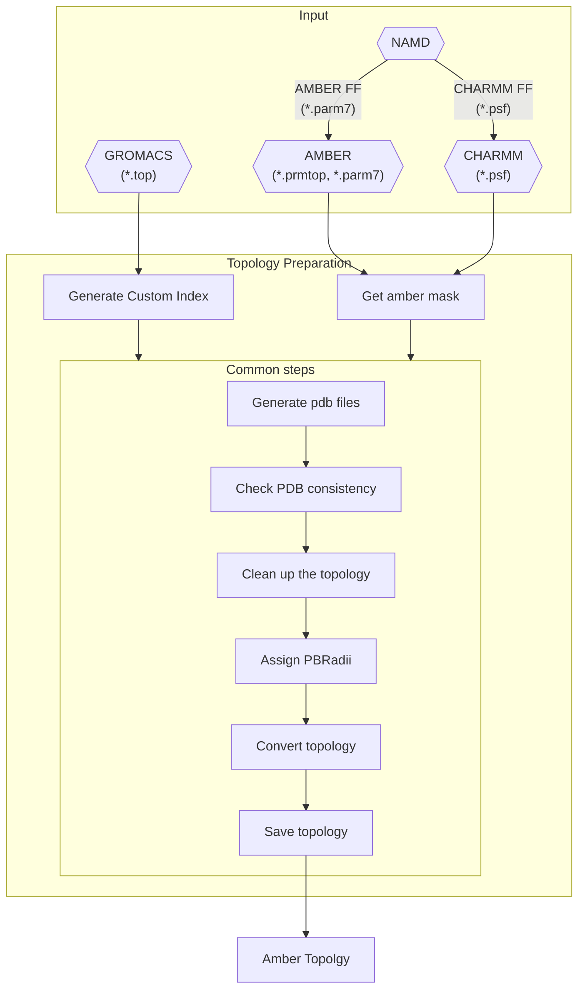

# How **xBFreE** works

xBFreE implements all the features in gmx_MMPBSA with support for GROMACS, AMBER, NAMD, and CHARMM. For now, this 
includes only MMPBSA and its derivatives as methods for calculating binding free energy. We intend to implement 
several more methods, such as Linear Interaction Energy (LIE), Free Energy Perturbation (FEP), Thermodynamics 
Integration (TI), etc.

## gmx_MMPBSA general workflow

**xBFreE** functioning can be divided into 2 parts as shown in figure 1. In the first part, `Preparation`, the 
topologies and trajectories are generated, among other elements depending on the calculations and MD program, such as 
the mutants for the alanine/glycine scanning or the list of interacting residues during decomposition analysis. In 
the second part, `Calculation`, the binding free energies and/or entropies are estimated using the selected models. 

!!! info "For gmx_MMPBSA users"
    Nota que el análisis de los resultados ahora está fuera del workflow de **xBFreE**. Ello se debe a que hemos 
    separado la herramienta de análisis **xBFreE-Analyzer** (antiguamente gmx_MMPBSA_ana) como un módulo 
    independiente. Consulta la documentación de [**xBFreE-Analyzer**]() para más información.   

**Figure 1**. **xBFreE** general workflow

## Required input files

Actualmente, solo los campos de fuerza AMBER y CHARMM son soportados oficialmente. Dependiendo del programa de MD se 
requieren uno o varios archivos diferentes.

| MD Program\Flags |        **-cp**        |     **-cs**      |          **-ct**           |       **-cg**        | **-ci** | **-cr** |
|:----------------:|:---------------------:|:----------------:|:--------------------------:|:--------------------:|:-------:|:-------:|
|     GROMACS      |        `*.top`        | `*.tpr`, `*.pdb` |      `*.xtc`, `*.trr`      | group number or name | `*.ndx` | `*.pdb` |
|      AMBER       | `*.prmtop`, `*.parm7` |   `*.pdb`[^1]    | `*.nc`, `*.crd`, `*.mdcrd` |      amber mask      |         |         |
|       NAMD       |  `*.psf`, `*.parm7`   |   `*.pdb`[^1]    |          `*.dcd`           |      amber mask      |         |         |
|      CHARMM      |        `*.psf`        |   `*.pdb`[^1]    |          `*.dcd`           |      amber mask      |         |         |

 [^1]: This file is the unique reference for every subsequent calculation, selection, etc. Make sure that this PDB file 
 are consistent.

!!! info "For gmx_MMPBSA users"
    Nota que la generación de la topología de Amber a partir de estructuras ya no es soportado. Ahora solo se 
    requiere la topología, sin importar que campo de fuerzas o programa de MD se haya usado. Esto también elimina 
    algunas flags y variables que generaban confusión, por ejemplo, la flag `-lm` y la variable `forcefields`. 

## Topology preparation

In this section, we will go in detail about each file and what they are used for.

