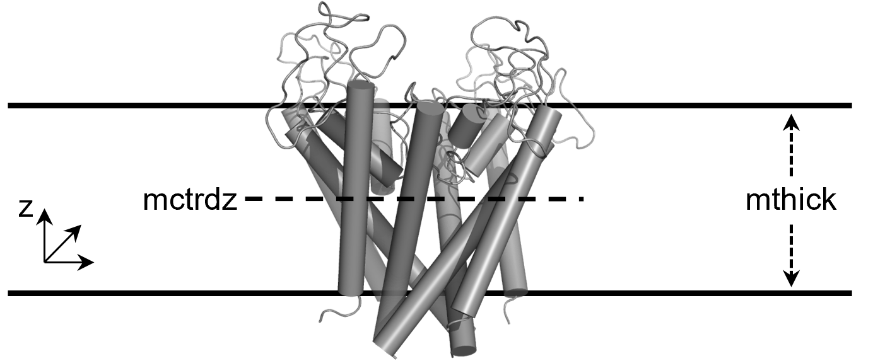

# The input file

## Description

**xBFreE** input file contains all the specifications for the MMPBSA calculations. The input file is syntactically 
similar to other programs in Amber, although we incorporated a new format more similar to the one used on GROMACS *.mdp 
files (see bleow). The input file contains sections called `namelist` where the variables are defined for each 
calculation. The allowed namelists are:

- [`&general`](#general-namelist-variables): contains variables that apply to all aspects of the 
  calculation or parameters required for building AMBER topologies from GROMACS files.
- [`&gb`](#gb-namelist-variables): unique variables to Generalized Born (GB) calculations.
- [`&gbnsr6`](#gbnsr6-namelist-variables): unique variables to GBNSR6 calculations.
- [`&pb`](#pb-namelist-variables): unique variables to Poisson Boltzmann (PB) calculations.
- [`&rism`](#rism-namelist-variables): unique variables to 3D-RISM calculations.
- [`&alanine_scanning`](#alanine_scanning-namelist-variables): unique variables to alanine scanning 
  calculations.
- [`&decomp`](#decomp-namelist-variables): unique variables to the decomposition scheme.
- [`&nmode`](#nmode-namelist-variables): unique variables to the normal mode (NMODE) calculations used to 
  approximate vibrational entropies.

  [1]: https://pubs.acs.org/doi/10.1021/ct300418h

## Generation of input files with **xBFreE**
The input file can be created using **xBFreE** by selecting the subcommand and the calculations you want to perform.

!!! note "Take a look at"
    Note that the command-line is basically the same for all MD programs. They only differ in the subcommand 
    selected according to the MD program.

=== "GROMACS"
    ``` title="Command-line"
    xbfree gmx_MMPBSA --create_input args
    ```
    where `args` can be:  `gb`, `gbnsr6`, `pb`, `rism`, `ala`, `decomp`, `nmode`, `all`

    Example:
    
    === "GB calculation"
            
            xbfree gmx_MMPBSA --create_input gb
        
    === "PB calculation"
        
            xbfree gmx_MMPBSA --create_input pb
    
    === "GB, PB and Decomposition calculations"
        
            xbfree gmx_MMPBSA --create_input gb pb decomp
    
    === "All calculations"
    
            xbfree gmx_MMPBSA --create_input
         
        or 
            
            xbfree gmx_MMPBSA --create_input all

=== "AMBER"
    ``` title="Command-line"
    xbfree amber_MMPBSA --create_input args
    ```
    where `args` can be:  `gb`, `gbnsr6`, `pb`, `rism`, `ala`, `decomp`, `nmode`, `all`
    
    Example:
    
    === "GB calculation"
            
            xbfree amber_MMPBSA --create_input gb
        
    === "PB calculation"
        
            xbfree amber_MMPBSA --create_input pb
    
    === "GB, PB and Decomposition calculations"
        
            xbfree amber_MMPBSA --create_input gb pb decomp
    
    === "All calculations"
    
            xbfree amber_MMPBSA --create_input
         
        or 
            
            xbfree amber_MMPBSA --create_input all

=== "NAMD"
    ``` title="Command-line"
    xbfree namd_MMPBSA --create_input args
    ```
    where `args` can be:  `gb`, `gbnsr6`, `pb`, `rism`, `ala`, `decomp`, `nmode`, `all`

    Example:
    === "GB calculation"
            
            xbfree namd_MMPBSA --create_input gb
        
    === "PB calculation"
        
            xbfree namd_MMPBSA --create_input pb
    
    === "GB, PB and Decomposition calculations"
        
            xbfree namd_MMPBSA --create_input gb pb decomp
    
    === "All calculations"
    
            xbfree namd_MMPBSA --create_input
         
        or 
            
            xbfree namd_MMPBSA --create_input all

=== "CHARMM"
    ``` title="Command-line"
    xbfree charmm_MMPBSA --create_input args
    ```
    where `args` can be:  `gb`, `gbnsr6`, `pb`, `rism`, `ala`, `decomp`, `nmode`, `all`
    
    Example:
    === "GB calculation"
            
            xbfree charmm_MMPBSA --create_input gb
        
    === "PB calculation"
        
            xbfree charmm_MMPBSA --create_input pb
    
    === "GB, PB and Decomposition calculations"
        
            xbfree charmm_MMPBSA --create_input gb pb decomp
    
    === "All calculations"
    
            xbfree charmm_MMPBSA --create_input
         
        or 
            
            xbfree charmm_MMPBSA --create_input all


!!! Danger 
    Note that several variables must be explicitly defined in the input file


## Format
All the input variables are described below according to their respective namelists. Descriptions are taken from 
original sources and modified accordingly when needed. Integers and floating point 
variables should be typed as-is while strings should be put in either single- or double-quotes. All variables should be 
set with `variable = value` and separated by commas is they appear in the same line. If the variables appear in different 
lines, the comma is no longer needed. See several [examples](#sample-input-files) are shown below. As you will see, several 
calculations can be performed in the same run (_i.e._ `&gb` and `&pb`; `&gb` and `&alanine_scanning`; `&pb` and
`&decomp`; etc). As we have mentioned, the input file can be generated using the `create_input` option of 
`xbfree <subcommand>`. 
This style, while retaining the same Amber format (derived from Fortran), is aesthetically more familiar to the GROMACS
style (`*.mdp`). However, it maintains the same essence, so it could be defined in any of the two format styles or even
combined. See the formats below:

=== "New format style "
    ``` title="New format style Input file example"
            
    # General namelist variables
    &general
      sys_name             = ""                      # System name
      startframe           = 1                       # First frame to analyze
      endframe             = 9999999                 # Last frame to analyze
      ...
      interval              = 1                      # The offset from which to choose frames from each trajectory file
    /
    
    # Generalized-Born namelist variables
    &gb
      igb                  = 5                       # GB model to use
      ...
      probe                = 1.4                     # Solvent probe radius for surface area calc
    /
    ```

=== "Old format style"
    ``` title="Old format style Input file example"
            
    # General namelist variables
    &general
      sys_name = "", startframe = 1, endframe = 9999999
      ...
      interval = 1
    /
    
    # Generalized-Born namelist variables
    &gb
      igb = 5, 
      ...
      probe = 1.4
    /
    ```

## Namelists

### **`&general` namelist variables**

#### **Basic input options**

[`sys_name`](#mmpbsa_ifv_sys_name){#mmpbsa_ifv_sys_name} (Default = None)
:   Define the System Name. This is useful when trying to analyze several systems at the same time or calculating 
the correlation between the predicted and the experimental energies. If the name is not defined, one will be assigned 
when loading the system in `gmx_MMPBSA_ana` on a first-come, first-served basis.

    !!! tip 
        The definition of the system name is entirely optional, however it can provide a better clarity during 
        the results analysis. All files associated with this system will be saved using its name.

[`startframe`](#mmpbsa_ifv_startframe){#mmpbsa_ifv_startframe} (Default = 1)
:   The frame from which to begin extracting snapshots from the full, concatenated trajectory comprised of
every trajectory file placed on the command-line. This is always the first frame read.

[`endframe`](#mmpbsa_ifv_endframe){#mmpbsa_ifv_endframe} (Default = 9999999)
:   The frame from which to stop extracting snapshots from the full, concatenated trajectory comprised of every
trajectory file supplied on the command-line.

[`interval`](#mmpbsa_ifv_interval){#mmpbsa_ifv_interval} (Default = 1)
:   The offset from which to choose frames from each trajectory file. For example, an interval of 2 will pull
every 2nd frame beginning at startframe and ending less than or equal to endframe.

#### **Parameter options**

[`PBRadii`](#mmpbsa_ifv_PBRadii){#mmpbsa_ifv_PBRadii} (Default = "mbondi2")
:   PBRadii to build amber topology files:

    * bondi, recommended when `igb = 7`
    * mbondi, recommended when `igb = 1`
    * mbondi2, recommended when `igb = 2` or `igb = 5`
    * mbondi3, recommended when `igb = 8`
    * mbondi_pb2

        ??? note "_mbondi_pb2_ radii set"
            It is based on _mbondi_ radii set and contains a  new optimized set of halogen PB radii for halogenated 
            compounds (without extra point (EP) of charge) parametrized with General Amber Force Field (GAFF):

            Values from Table 3 in [§3.1 Halogen Radii Optimization Without EP][300]:

            * Cl: 1.76
            * Br: 1.97
            * I: 2.09
    
            This radii set should be used with the following PBSA setup:
    
            ```
            Sample input file for PB calculation with halogenated compounds
            
            &general
            sys_name="PB_Halogens",
            PBRadii="mbondi_pb2",
            /
            &pb
            radiopt=0, istrng=0.150, inp=1,
            /
            ```

    * mbondi_pb3

        ??? note "_mbondi_pb3_ radii set"
            It is based on _mbondi_ radii set and contains a new optimized set of halogen PB radii for halogenated 
            compounds (without extra point (EP) of charge) parametrized with General Amber Force Field (GAFF):

            Values from Table 3 in [§3.1 Halogen Radii Optimization Without EP][300]:

            * Cl: 2.20
            * Br: 2.04
            * I: 2.19
                    

            This radii set should be used with the following PBSA setup:
    
            ```
            Sample input file for PB calculation with halogenated compounds
            
            &general
            sys_name="PB_Halogens",
            PBRadii="mbondi_pb3",
            /
            &pb
            radiopt=0, istrng=0.150, inp=1,
            /
            ```
            
  [300]: https://pubs.acs.org/doi/full/10.1021/acs.jctc.9b00106

    * charmm_radii, compatible only with &pb
        
        ??? note "_charmm_radii_ radii set"
            **Use only with systems prepared with CHARMM force fields**. This atomic radii set for Poisson-Boltzmann 
            calculations has been derived from average solvent electrostatic charge distribution with explicit 
            solvent. The accuracy has been tested with free energy perturbation with explicit solvent. Most of the 
            values were taken from a _*radii.str_ file used in PBEQ Solver in 
            [charmm-gui](https://www.charmm-gui.org/?doc=input/pbeqsolver).
            * Radii for protein atoms in 20 standard amino acids from 
            [Nina, Belogv, and Roux](https://pubs.acs.org/doi/10.1021/jp970736r)
            * Radii for nucleic acid atoms (RNA and DNA) from 
            [Banavali and Roux](https://pubs.acs.org/doi/abs/10.1021/jp025852v)
            * Halogens and other atoms from [Fortuna and Costa](https://pubs.acs.org/doi/10.1021/acs.jcim.1c00177)
            


[`temperature`](#mmpbsa_ifv_temperature){#mmpbsa_ifv_temperature} (Default = 298.15)  
:   Specify the temperature (in K) used in the calculations.
   
#### **Entropy options**

[`qh_entropy`](#mmpbsa_ifv_qh_entropy){#mmpbsa_ifv_qh_entropy} (Default = 0)
:    It specifies whether to perform a quasi-harmonic entropy (QH) approximation with `cpptraj` or not.
     
     * 0: Don’t
     * 1: perform QH

    !!! important "Keep in mind"
        * The number of frames used for QH analyses should be higher than 3N, N being the number of atoms in the 
        complex
        * Check this [thread](http://archive.ambermd.org/201207/0319.html) for more info on QH analysis

[`interaction_entropy`](#mmpbsa_ifv_interaction_entropy){#mmpbsa_ifv_interaction_entropy} (default = 0)
:    It specifies whether to use the [Interaction Entropy (IE)][3] approximation.
     
     * 0: Don’t
     * 1: perform IE

    !!! note "Keep in mind"
        - The Interaction Entropy can be calculated independently of the solvent model used.
        - A sample Interaction Entropy input file is shown [here](input_file.md#interaction-entropy)
        - A tutorial on the use of Interaction Entropy is 
        available [here](examples/Entropy_calculations/Interaction_Entropy/README.md)
        - The standard deviation of the interaction energy (`σIE`) should always be reported when using the Interaction 
        Entropy method.
        - The Interaction Entropy method should be avoided if `σIE > ~ 3.6 kcal/mol` because it is impossible to 
        converge the exponential average.
        - It is advisable to study how the Interaction Entropy depends on N by block averaging (which also provide an 
        estimate of the precision of the calculated entropies).
        - A sampling frequency of 10 fs, as reported in the original [IE publication][3], seems to be 3–40 times too 
        dense. A sampling frequency of 0.1 ps would be more appropriate.
        - The Interaction Entropy results may vary depending on the system flexibility or whether constraints were used 
        or not in the MD simulation. 

        Please, check this [paper][10] for further details.

  [3]: https://pubs.acs.org/doi/abs/10.1021/jacs.6b02682
  [10]: https://pubs.acs.org/doi/full/10.1021/acs.jctc.1c00374


[`ie_segment`](#mmpbsa_ifv_ie_segment){#mmpbsa_ifv_ie_segment} (Default = 25)
:    Representative segment (in %), starting from the last frame, for the calculation of the
Interaction Entropy, _e.g._: `ie_segment = 25` means that the last quartile of the total number of frames
(`(endframe-startframe)/interval`) will be used to calculate the average Interaction Entropy.

[`c2_entropy`](#mmpbsa_ifv_c2_entropy){#mmpbsa_ifv_c2_entropy} (default = 0) 
:    It specifies whether to use the [C2 Entropy][11] approximation.
     
     * 0: Don’t
     * 1: perform C2

    !!! note "Keep in mind"
        - The C2 Entropy can be calculated independently of the solvent model used.
        - A tutorial on the use of C2 Entropy is 
        available [here](examples/Entropy_calculations/C2_Entropy/README.md)
        - The standard deviation of the interaction energy (`σIE`) should always be reported.
        - The C2 Entropy method should be avoided if `σIE > ~ 3.6 kcal/mol` because it gives unrealistically large 
        entropies.
        - It is advisable to study how the C2 Entropy depends on N by block averaging (which also provide an 
        estimate of the precision of the calculated entropies).
        - A sampling frequency of 10 fs, seems to be 3–40 times too dense. A sampling frequency of 0.1 ps would be more 
        appropriate.
        - The C2 Entropy results may vary depending on the system flexibility or whether constraints were used 
        or not in the MD simulation.

        Please, check this [paper][10] for further details.

  [10]: https://pubs.acs.org/doi/full/10.1021/acs.jctc.1c00374
  [11]: https://pubs.acs.org/doi/full/10.1021/acs.jctc.8b00418

#### **Miscellaneous options**

[`assign_chainID`](#mmpbsa_ifv_assign_chainID){#mmpbsa_ifv_assign_chainID} (Default = 0) 
:   Defines the chains ID assignment mode. _It is ignored when defining a reference structure
(recommended)_. If `assign_chainID = 1`, **xBFreE** check if the structure has no chains ID, and it is assigned 
according to the structure[^1]. If `assign_chainID = 2`, **xBFreE** assign the chains ID, exist or not, 
according to the structure[^1] (can generate inconsistencies).

  [^1]: _The chain ID is assigned according to two criteria: **terminal amino acids** and **residue numbering**. If
        both criteria or residue numbering changes are present, we assign a new chain ID. If there are terminal 
        amino acids, but the numbering of the residue continues, we do not change the ID of the chain._

[`exp_ki`](#mmpbsa_ifv_exp_ki){#mmpbsa_ifv_exp_ki} (Default = 0.0)
:   Specify the experimental Ki (in nM) for correlations analysis. If not defined or exp_ki = 0 then this system 
will be omitted in the correlation analysis

[`full_traj`](#mmpbsa_ifv_full_traj){#mmpbsa_ifv_full_traj} (Default = 0)
:   Print trajectories

    * 0: Print only thread trajectories in *.mdcrd format
    * 1: Print a full traj and the thread trajectories in *.mdcrd format

[`gmx_path`](#mmpbsa_ifv_gmx_path){#mmpbsa_ifv_gmx_path} 
:   Define a path to search for GROMACS executables. This path takes precedence over the path defined
in the PATH variable. In this path the following executables will be searched: `gmx`, `gmx_mpi`, `gmx_d`, or
`gmx_mpi_d` (GROMACS > 5.x.x), and `make_ndx`, `editconf` and `trjconv` (GROMACS 4.x.x)

    !!! note "Keep in mind"
        This variable is used when the GROMACS used to run the system differs from that of will be used for running 
        the analyses. It takes the path to the GROMACS bin folder where the executables will be searched on. 
        An example of the use of this variable is given below:

            &general
            sys_name="my_system",
            verbose=2, forcefields="oldff/leaprc.ff99SBildn",leaprc.gaff"
            gmx_path="/home/programs/gromacs/bin"
            /
            &gb
            igb=5, saltcon=0.150  
            /
           
            # replace this "/home/programs/gromacs/bin" with the path to the GROMACS you want to use.

[`keep_files`](#mmpbsa_ifv_keep_files){#mmpbsa_ifv_keep_files} (Default = 2)
:   Specifies which files are kept.

    * 0: Keep only binary file (_COMPACT_gmx_MMPBSA_RESULTS.mmxsa_)
    * 1: Keep all temporary files (_prefix_*)
    * 2: Keep all temporary files (_prefix_*) and binary file

    !!! note "Keep in mind"
        The binary file contains all the information necessary to analyze the data with gmx_MMPBSA_ana. Its 
        use is only recommended in special cases where the original 
        raw data is not present. We recommnend to use `keep_files = 1` or `keep_files = 2` to 
        avoid errors when using `gmx_MMPBSA_ana`

[`netcdf`](#mmpbsa_ifv_netcdf){#mmpbsa_ifv_netcdf} (Default = 0)
:   Specifies whether to use NetCDF trajectories internally rather than writing temporary ASCII trajectory
files. For very large trajectories, this could offer significant speedups, and requires less temporary space. 
However, this option is incompatible with alanine scanning.

    * 0: Do NOT use temporary NetCDF trajectories
    * 1: Use temporary NetCDF trajectories

[`solvated_trajectory`](#mmpbsa_ifv_solvated_trajectory){#mmpbsa_ifv_solvated_trajectory} (Default = 1)
:   Define if it is necessary to generate a clean trajectory with no water and ions.
    
    * 0: Don’t
    * 1: Generate clean trajectory

[`verbose`](#mmpbsa_ifv_verbose){#mmpbsa_ifv_verbose} (Default = 1)
:   Specifies how much output is printed in the output file.

    * 0: Print only difference terms
    * 1: Print all complex, receptor, ligand, and difference terms

### **`&gb` namelist variables**

!!! note "Keep in mind"
    * A default GB input file can be created as follows:

        === "GROMACS"
            ```
            xbfree gmx_MMPBSA --create_input gb
            ```
        === "AMBER"
            ```
            xbfree amber_MMPBSA --create_input gb
            ```
        === "NAMD"
            ```
            xbfree namd_MMPBSA --create_input gb
            ```
        === "CHARMM"
            ```
            xbfree charmm_MMPBSA --create_input gb
            ```
            

    * A sample GB input file is shown [here](input_file.md#gb)
    * A tutorial on binding free energy calculation with GB model is available 
    [here](examples/Protein_ligand/ST/README.md)

#### **Basic input options**

[`igb`](#mmpbsa_ifv_igb){#mmpbsa_ifv_igb} (Default = 5)
:   Generalized Born method to use (see [§4](https://ambermd.org/doc12/Amber21.pdf#chapter.4) for more info).

    * 1: The [Hawkins, Cramer, Truhlar][191] pairwise GB model (GB-HCT)
    * 2: Modified GB model 1 developed by [A. Onufriev, D. Bashford and D.A. Case][188] (GB-OBC1)
    * 5: Modified GB model 2 developed by [A. Onufriev, D. Bashford and D.A. Case][188] (GB-OBC2)
    * 7: GBn model described by [Mongan, Simmerling, McCammon, Case and Onufriev][206] (GB-Neck)
    * 8: Same GB functional form as the GBn model (igb=7), but with different parameters. Developed by [Nguyen, Pérez, 
         Bermeo, and Simmerling][200] (GB-Neck2)

  [191]: https://pubs.acs.org/doi/10.1021/jp961710n
  [188]: https://onlinelibrary.wiley.com/doi/10.1002/prot.20033
  [206]: https://pubs.acs.org/doi/10.1021/ct600085e
  [200]: https://pubs.acs.org/doi/10.1021/acs.jctc.5b00271

[`alpb`](#mmpbsa_ifv_alpb){#mmpbsa_ifv_alpb} (Default = 0)
:   Use [Analytical Linearized Poisson-Boltzmann (ALPB)][209] approximation to handle electrostatic interactions 
within the implicit solvent model (see [§4.2](https://ambermd.org/doc12/Amber21.pdf#section.4.2)):

    $$
    ∆𝐺_{el} \approx ∆𝐺_{alpb} = -\frac{1}{2} (\frac{1}{ε_{in}} - \frac{1}{ε_{ex}})\frac{1}{1+αβ} \sum_{ij} q_{i}q_{j}(\frac{1}{f_{GB}} + \frac{αβ}{A})
    $$

    where $β = \frac{ε_{in}}{ε_{ex}}$ is the ratio of the internal and external dielectrics, $α=0.571412$, and A 
    is the so-called effective electrostatic size of the molecule (see `arad_method` below). The ALPB requires one 
    of the analytical GB models to be set, that is igb = 1, 2, 5, or 7, for computing the effective Born radii. It uses 
    the same sets of radii as required by the particular GB model.

    * 0: Don't
    * 1: Use ALPB

  [209]: https://aip.scitation.org/doi/10.1063/1.1857811

[`arad_method`](#mmpbsa_ifv_arad_method){#mmpbsa_ifv_arad_method} (Default = 1)
:   Method used to estimate the effective electrostatic size/radius (`A` in ALPB equation) of the molecule 
(See [Sigalov, Fenley, and Onufriev](https://aip.scitation.org/doi/10.1063/1.2177251)).

    * 1: Use structural invariants
    * 2: Use elementary functions
    * 3: Use elliptic integral (numerical)

[`intdiel`](#mmpbsa_ifv_intdiel){#mmpbsa_ifv_intdiel} (Default = 1.0)
:   Define Internal dielectric constant.

[`extdiel`](#mmpbsa_ifv_extdiel){#mmpbsa_ifv_extdiel} (Default = 78.5)
:   Define External dielectric constant.

[`saltcon`](#mmpbsa_ifv_saltcon){#mmpbsa_ifv_saltcon} (Default = 0.0)
:   Salt concentration in Molarity (M).

[`rgbmax`](#mmpbsa_ifv_rgbmax){#mmpbsa_ifv_rgbmax} (Default = 999.0)
:   Distance cutoff in Å to use when computing effective GB radii.

[`surften`](#mmpbsa_ifv_surften){#mmpbsa_ifv_surften} (Default = 0.0072)
:   Surface tension value. Units in kcal/mol/Å^2^

[`surfoff`](#mmpbsa_ifv_surfoff){#mmpbsa_ifv_surfoff} (Default = 0.0)
:   Offset to correct (by addition) the value of the non-polar contribution to the solvation free energy term.

[`molsurf`](#mmpbsa_ifv_molsurf){#mmpbsa_ifv_molsurf} (Default = 0)
:   Define the algorithm to calculate the surface area for the non-polar solvation term.
    
    * 0: LCPO (Linear Combination of Pairwise Overlaps)
    * 1: molsurf algorithm

[`msoffset`](#mmpbsa_ifv_msoffset){#mmpbsa_ifv_msoffset} (Default = 0) 
:   Offset to apply to the individual atomic radii in the system when calculating the `molsurf` surface. See the
description of the `molsurf` action command in [cpptraj][4].

[`probe`](#mmpbsa_ifv_probe){#mmpbsa_ifv_probe} (Default = 1.4)
:   Radius in Å of the probe molecule (supposed to be the size of a solvent molecule), to use when determining the 
molecular surface.
    
    !!! note
        only applicable when `molsurf` is set to 1

#### **QM options**

[`ifqnt`](#mmpbsa_ifv_ifqnt){#mmpbsa_ifv_ifqnt} (Default = 0)
:   Specifies whether a part of the system is treated with quantum mechanics.
    
    * 0: Potential function is strictly classical
    * 1: Use QM/MM

    !!! note "Keep in mind"
        * Calculations where part of the system is treated with quantum mechanics can be performed only with GB
        * A sample QM/MMGBSA input file is shown [here](input_file.md#qmmmgbsa)
        * A tutorial on binding free energy calculation with QM/MMGBSA is available 
        [here](examples/QM_MMGBSA/README.md)

[`qm_theory`](#mmpbsa_ifv_qm_theory){#mmpbsa_ifv_qm_theory} 
:   Which semi-empirical Hamiltonian should be used for the quantum calculation. Options are `PM3`, `AM1`, `MNDO`, 
`PDDG-PM3`, `PM3PDDG`, `PDDG-MNDO`, `PDDGMNDO`, `PM3-CARB1`, `PM3CARB1`, `DFTB`, `SCC-DFTB`, `RM1`, `PM6`, 
`PM3-ZnB`, `PM3-MAIS`, `PM3ZNB`, `MNDO/D`, `MNDOD`. The dispersion correction can be switched on for `AM1` 
and `PM6` by choosing `AM1-D*` and `PM6-D`, respectively. The dispersion and hydrogen bond correction will be 
applied for `AM1-DH+` and `PM6-DH+`.

    !!! danger
         No `qm_theory` default, this must be specified if `ifqnt` = 1.

[`qm_residues`](#mmpbsa_ifv_qm_residues){#mmpbsa_ifv_qm_residues}
:   Complex residues to treat with quantum mechanics. All residues treated with quantum mechanics in the complex 
must be treated with quantum mechanics in the receptor or ligand to obtain meaningful results. This notation is 
the same used for `print_res` variable in `&decomp` namelist.

    !!! danger
         No `qm_residues` default, this must be specified if `ifqnt` = 1.

    !!! example "Selection schemes"

        === "By Distance (recommended)"
            Notation: [ `within` `distance` ]
            :   `within` corresponds to the keyword and `distance` to the maximum distance criterion in Å necessary to 
                select the residues from both the receptor and the ligand. In case the cutoff used is so small that 
                the number of qm_residues = 0, the cutoff value will be increased by 0.1 until the number of 
                qm_residues > 0.
    
            !!! example
                `qm_residues="within 5"` Residues within 5 Å between receptor and ligand will be treated with quantum 
                mechanic.

        === "Amino acid selection"
            Notation: [ `CHAIN`/(`RESNUM` or `RESNUM-RESNUM`) ]
            :    Treat with quantum mechanics residues individual or ranges. This notation also supports insertion 
            codes, in which case you must define them individually

            `qm_residues="A/1,3-10,15,100"` This treat with quantum mechanic Chain A residues 1, 3 through 10, 15, and 
            100 from the complex topology file and the corresponding residues in either the ligand and/or receptor 
            topology files.
    
            Let's suppose that we can have the following sequence: - A:LEU:5 - A:GLY:6:A - A:THR:6:B - A:SER:6:C - 
            A:ASP:6:D - A:ILE:7
    
            with the format `CHAIN`/`RESNUMBER` `INSERTION_CODE`
            
            === "Right notation"
                
                **Ranges selection**
                :   `qm_residues="A/5-7` Will treat with quantum mechanic all mentioned residues because all residues with 
                insertion code are contained in the range
                
                **Individual selection**
                :   `qm_residues="A/5,6B,6C,7` Will treat with quantum mechanic all mentioned residues except the 
                residues 6A and 6D from chain A
                
                **Multiple chain selection**
                :   `qm_residues="A/5-10,100 B/34,56` Will treat with quantum mechanic residues 5 through 10, and 100 from 
                chain A, and residues 34 and 56 from Chain B.
    
            === "Wrong notation"
                `qm_residues="A/5-6B,6D-7` Will end in error.

[`qmcharge_com`](#mmpbsa_ifv_qmcharge_com){#mmpbsa_ifv_qmcharge_com} (Default = 0)
:   The charge of the quantum section for the complex.

    _Deprecated in v1.5.0: Now, `qmcharge_com` is assigned automatically based on the selection_

[`qmcharge_lig`](#mmpbsa_ifv_qmcharge_lig){#mmpbsa_ifv_qmcharge_lig} (Default = 0)
:   The charge of the quantum section of the ligand.

    _Deprecated in v1.5.0: Now, `qmcharge_lig` is assigned automatically based on the selection_

[`qmcharge_rec`](#mmpbsa_ifv_qmcharge_rec){#mmpbsa_ifv_qmcharge_rec} (Default = 0)
:   The charge of the quantum section for the receptor.

    _Deprecated in v1.5.0: Now, `qmcharge_rec` is assigned automatically based on the selection_

[`qmcut`](#mmpbsa_ifv_qmcut){#mmpbsa_ifv_qmcut} (Default = 9999.0)
:   The cutoff for the qm/mm charge interactions.

[`scfconv`](#mmpbsa_ifv_scfconv){#mmpbsa_ifv_scfconv} (Default = 1.0e-8)
:   Controls the convergence criteria for the SCF calculation, in kcal/mol. The tighter the 
convergence the longer the calculation will take. Values tighter than 1.0e-11 are not recommended as these can lead 
to oscillations in the SCF, due to limitations in machine precision, that can lead to convergence failures.

[`writepdb`](#mmpbsa_ifv_writepdb){#mmpbsa_ifv_writepdb} (Default = 1)
:   Write a PDB file of the selected QM region. This option is designed to act as an aid to the user to
allow easy checking of what atoms were included in the QM region. Write a PDB file of the atoms in the QM region 
on the very first step to a file named qmmm_region.pdb.

    * 0: Don't
    * 1: Write a PDB file of the selected QM region

[`peptide_corr`](#mmpbsa_ifv_peptide_corr){#mmpbsa_ifv_peptide_corr} (Default = 0)
:   Apply MM correction to peptide linkages. This correction is of the form: 

[comment]: <> (     (    image?E_{scf}&space;=&space;E_{scf}&space;&plus;&space;h_{type}&#40;i_{type}&#41;)

[comment]: <> (    *sin^{2}\phi" title="https://latex.codecogs.com/svg.image?E_{scf} = E_{scf} + h_{type}&#40;i_{type}&#41;*sin^{2}\phi )

[comment]: <> (    align="center""/>)

    $$
    E_{scf} = E_{scf} + h_{type}(i_{type}) * sin^{2}\phi
    $$

    where _ϕ_ is the dihedral angle of the H-N-C-O linkage and $h_{type}$ is a constant dependent on the 
    Hamiltonian used. Recommended, except for DFTB/SCC-DFTB.

    * 0: Don't
    * 1: Apply a MM correction to peptide linkages

[`verbosity`](#mmpbsa_ifv_verbosity){#mmpbsa_ifv_verbosity} (Default = 0)
:   Controls the verbosity of QM/MM related output. Values of 2 or higher will produce a lot of output.

    * 0: only minimal information is printed - Initial QM geometry and link atom positions as
    well as the SCF energy at every ntpr steps.
    * 1: Print SCF energy at every step to many more significant figures than usual. Also print the
    number of SCF cycles needed on each step.
    * 2: As 1 and also print info about memory reallocations, number of pairs per QM atom, QM core -
    QM core energy, QM core - MM atom energy, and total energy.
    * 3: As 2 and also print SCF convergence information at every step.
    * 4: As 3 and also print forces on the QM atoms due to the SCF calculation and the coordinates of
    the link atoms at every step.
    * 5: As 4 and also print all of the info in kJ/mol as well as kcal/mol.
    
  [4]: https://ambermd.org/doc12/Amber21.pdf#subsection.34.11.49

### **`&gbnsr6` namelist variables**

!!! note "Keep in mind"
    * GBNSR6 is an implementation of the Generalized Born (GB) model in which the effective Born radii are computed 
    numerically, via the so-called "R6" integration ([ref.][222]) over molecular surface of the solute. In contrast to 
    most GB practical models, GBNSR6 model is parameter free in the same sense as the numerical PB framework is. Thus, 
    accuracy of GBNSR6 relative to the PB standard is virtually unaffected by the choice of input atomic radii. Check
    Chapter [§5](https://ambermd.org/doc12/Amber21.pdf#chapter.5) in Amber manual for a more thorough description 
    of the GBNSR6 model and its parameters.
    * A default GBNSR6 input file can be created as follows:

        === "GROMACS"
            ```
            xbfree gmx_MMPBSA --create_input gbnsr6
            ```
        === "AMBER"
            ```
            xbfree amber_MMPBSA --create_input gbnsr6
            ```
        === "NAMD"
            ```
            xbfree namd_MMPBSA --create_input gbnsr6
            ```
        === "CHARMM"
            ```
            xbfree charmm_MMPBSA --create_input gbnsr6
            ```

    * A sample GBNSR6 input file is shown [here](input_file.md#gbnsr6)
    * A tutorial on binding free energy calculation with GBNSR6 model is available 
    [here](examples/GBNSR6/README.md)

  [222]: https://pubs.acs.org/doi/abs/10.1021/ct200786m

#### **Basic input options**

[`epsin`](#mmpbsa_ifv_epsin){#mmpbsa_ifv_epsin} (Default = 1.0)
:   Dielectric constant of the solute region.

[`epsout`](#mmpbsa_ifv_epsout){#mmpbsa_ifv_epsout} (Default = 78.5)
:   Implicit solvent dielectric constant for the solvent.

[`istrng`](#mmpbsa_ifv_istrng){#mmpbsa_ifv_istrng} (Default = 0.0)
:   Ionic strength in M for the GBNSR6 equation.
                           
[`dprob`](#mmpbsa_ifv_dprob){#mmpbsa_ifv_dprob} (Default = 1.4)
:   Radius of the solvent probe.

[`cavity_surften`](#mmpbsa_ifv_cavity_surften){#mmpbsa_ifv_cavity_surften} (Default = 0.005)
:   Surface tension parameter for nonpolar solvation calculation.

#### **Options to select numerical procedures**

[`space`](#mmpbsa_ifv_space){#mmpbsa_ifv_space} (Default = 0.5)
:   Sets the grid spacing that determines the resolution of the solute molecular surface. Note that memory footprint of 
this grid-based implementation of GBNSR6 may become large for large structures, e.g. the nucleosome (about 25,000 
atoms) will take close to 2 GB of RAM when the default grid spacing is used. For very large structures, one may 
consider increasing the value of space, which will reduce the memory footprint and execution time; however, the 
accuracy will also decrease.

[`arcres`](#mmpbsa_ifv_arcres){#mmpbsa_ifv_arcres} (Default = 0.2)
:   Arc resolution used for numerical integration over molecular surface.

[`b`](#mmpbsa_ifv_b){#mmpbsa_ifv_b} (Default = 0.028)
:   Specifies the value of uniform offset to the (inverse) effective radii, the default value 0.028 gives 
better agreement with the PB model, regardless of the structure size. For best agreement with the explicit solvent 
(TIP3P) solvation energies, optimal value of B depends on the structure size: for small molecules (number of atoms 
less than 50), B=0 is recommended. With -chagb option, B is calculated automatically based on the solute size.

[`alpb`](#mmpbsa_ifv_alpb-1){#mmpbsa_ifv_alpb-1} (Default = 1)
:   Specifies if ALBP correction is to be used.

    * 0: Canonical GB is used.
    * 1: ALPB is used (default)

#### **Options for CHAGB model**

[`chagb`](#mmpbsa_ifv_chagb){#mmpbsa_ifv_chagb} (Default = 0)
:   Define if CHAGB is used.

    * 0: Do not use CHAGB.
    * 1: Use CHAGB.

[`rs`](#mmpbsa_ifv_rs){#mmpbsa_ifv_rs} (Default = 0.52)
:   Dielectric boundary shift compared to the molecular surface.

[`radiopt`](#mmpbsa_ifv_radiopt){#mmpbsa_ifv_radiopt} (Default = 0)
:   Set of intrinsic atomic radii to be used.

    * 0: uses hardcoded intrisic radii optimized for small drug like molecules, and single amino acid
    dipeptides ([ref.][215])
    * 1: intrinsic radii are read from the topology file. Note that the dielectric surface defined using
    these radii is then shifted outwards by Rs relative to the molecular surface. The option is not
    recommended unless you are planning to re-optimize the input radii set for your problem.

  [215]: https://pubs.acs.org/doi/full/10.1021/ct4010917

[`roh`](#mmpbsa_ifv_roh){#mmpbsa_ifv_roh} (Default = 1)
:   Sets the value of R<sup>z</sup><sub>OH</sub> for CHAGB model, the default is 0.586Å. This parameter defines which 
explicit water model is being mimicked with respect to its propensity to cause charge hydration asymmetry. A perfectly 
tetrahedral water , which can not cause charge hydration asymmetry, would have R<sup>z</sup><sub>OH</sub> = 0. The 
options for `roh` are:

    * 1: R<sup>z</sup><sub>OH</sub> = 0.586Å corresponds to TIP3P and SPC/E. 
    * 2: R<sup>z</sup><sub>OH</sub> = 0.699Å for OPC.
    * 3: R<sup>z</sup><sub>OH</sub> = 0.734Å for TIP4P 
    * 4: R<sup>z</sup><sub>OH</sub> = 0.183Å for TIP5P/E. 

[`tau`](#mmpbsa_ifv_tau){#mmpbsa_ifv_tau} (Default = 1.47)
:   Value of τ in the CHAGB model. This dimensionless parameter controls the effective range of the neighboring 
charges (_j_) affecting the CHA of atom (_i_), see ([ref.][215]) for details.

### **`&pb` namelist variables**

!!! note "Keep in mind"
    * **xBFreE** uses **_sander_** to perform PB calculations. **_sander_** offers access to all [pbsa][5] 
    functionalities. The default values for the variables described below are appropriate for most calculations 
    on solvated molecular systems. Also note that the default options may have changed over time. A more thorough 
    description of all the options can be found [here][5]. For a detailed discussion of all related options on 
    the quality of the MM/PB(GB)SA calculations, please check this [publication][6].
    * A default PB input file can be created as follows:

        === "GROMACS"
            ```
            xbfree gmx_MMPBSA --create_input pb
            ```
        === "AMBER"
            ```
            xbfree amber_MMPBSA --create_input pb
            ```
        === "NAMD"
            ```
            xbfree namd_MMPBSA --create_input pb
            ```
        === "CHARMM"
            ```
            xbfree charmm_MMPBSA --create_input pb
            ```
    
    * A sample PB input file is shown [here](input_file.md#pb)
    * A tutorial on binding free energy calculation with PB model is available 
    [here](examples/Linear_PB_solver/README.md)

#### **Basic input options**

[`ipb`](#mmpbsa_ifv_ipb){#mmpbsa_ifv_ipb} (Default = 2)
:   Option to set up a dielectric model for all numerical PB procedures. `ipb = 1` corresponds to a classical geometric 
method, while a level-set based algebraic method is used when `ipb > 2`.

    * 1: The dielectric interface between solvent and solute is built with a geometric approach. ([ref.][217])
    * 2: The dielectric interface is implemented with the level set function. Use of a level set function
    simplifies the calculation of the intersection points of the molecular surface and grid edges and
    leads to more stable numerical calculations. ([ref.][239])
    * 4: The dielectric interface is also implemented with the level set function. However, the linear
    equations on the grid points nearby the dielectric boundary are constructed using the IIM. In this
    option, The dielectric constant do not need to be smoothed, that is, `smoothopt` is useless.
    Only the linear PB equation is supported, that is, `npbopt = 0`. Starting from the Amber 2018
    release, `solvopt` is no longer relevant as only one stable solver is supported. ([ref.][233])
    * 6: The dielectric interface is implemented analytically with the revised density function approach
    (`sasopt = 2`). The linear equations on the irregular points are constructed using the IIM and
    fully utilizing the analytical surface. Otherwise, it is exactly the same as `ipb = 4`. ([ref.][240])
    * 7: The dielectric interface is implemented analytically with the revised density function approach
    (`sasopt = 2`). The linear equations on the irregular points are constructed using the Χ-factor
    harmonic average method. ([ref.][241])
    * 8: The dielectric interface is implemented analytically with the revised density function approach
    (`sasopt = 2`). The linear equations on the irregular points are constructed using the secondorder harmonic 
    average method. ([ref.][241])

  [217]: https://onlinelibrary.wiley.com/doi/10.1002/jcc.10120
  [239]: https://pubs.acs.org/doi/10.1021/ct300341d
  [233]: https://www.sciencedirect.com/science/article/abs/pii/S0009261408016539?via%3Dihub
  [240]: https://onlinelibrary.wiley.com/doi/10.1002/jcc.25783
  [241]: https://pubs.acs.org/doi/10.1021/acs.jctc.9b00602

[`inp`](#mmpbsa_ifv_inp){#mmpbsa_ifv_inp} (Default = 1) 
:   Option to select different methods to compute non-polar solvation free energy.

    * 1: The total non-polar solvation free energy is modeled as a single term linearly proportional to the
    solvent accessible surface area ([ref.][227]). When using `inp = 1`:

        * `sprob` is reset to 1.4
        * `cavity_surften` is reset to 0.005
        * `cavity_offset` is reset to 0.000

    * 2: The total non-polar solvation free energy is modeled as two terms: the cavity term and the
    dispersion term. The dispersion term is computed with a surface-based integration method
    ([ref.][227]) closely related to the PCM solvent for quantum chemical programs. ([ref.][229]) Under this
    framework, the cavity term is still computed as a term linearly proportional to the molecular
    solvent-accessible-surface area (SASA) or the molecular volume enclosed by SASA.

    !!! info "Keep in mind"
        Sometimes, high values for the solvation energy are obtained using `inp=2`. Check 
        this [section](https://valdes-tresanco-ms.github.io/gmx_MMPBSA/dev/Q%26A/calculations/#possible-solutions_2) to 
        see a workaround.

  [227]: https://pubs.acs.org/doi/abs/10.1021/jp073399n
  [229]: https://onlinelibrary.wiley.com/doi/10.1002/jcc.540100504

[`sander_apbs`](#mmpbsa_ifv_sander_apbs){#mmpbsa_ifv_sander_apbs} (Default = 0)
:   Option to use `APBS` for `PB` calculation instead of the built-in `PBSA` solver. This will work only through the
    `iAPBS` interface built into `sander.APBS`. Instructions for this can be found online at the iAPBS/APBS websites.
    
    * 0: Don’t use `APBS`
    * 1: Use `sander.APBS`

#### **Options to define the physical constants**

[`indi`](#mmpbsa_ifv_indi){#mmpbsa_ifv_indi} (Default = 1.0)
:   Internal dielectric constant. This corresponds to `epsin` in [pbsa][5].

[`exdi`](#mmpbsa_ifv_exdi){#mmpbsa_ifv_exdi} (Default = 80.0)
:   External dielectric constant. This corresponds to `epsout` in [pbsa][5].

[`emem`](#mmpbsa_ifv_emem){#mmpbsa_ifv_emem} (Default = 4.0)
:   Sets the membrane dielectric constant. Only used if `memopt` > 0, does nothing otherwise. Value
used should be between `indi` and `exdi` or there may be errors. This corresponds to `epsmem` in [pbsa][5].

[`smoothopt`](#mmpbsa_ifv_smoothopt){#mmpbsa_ifv_smoothopt} (Default = 1)
:   Instructs PB how to set up dielectric values for finite-difference grid edges that are located across the
solute/solvent dielectric boundary.

    * 0: The dielectric constants of the boundary grid edges are always set to the equal-weight harmonic
    average of `indi` and `exdi`.
    * 1: A weighted harmonic average of `indi` and `exdi` is used for boundary grid edges. The
    weights for `indi` and `exdi` are fractions of the boundary grid edges that are inside or
    outside the solute surface. ([ref.][243])
    * 2: The dielectric constants of the boundary grid edges are set to either `indi` or `exdi` depending on whether 
    the midpoints of the grid edges are inside or outside the solute surface.

  [243]: https://pubs.acs.org/doi/10.1021/cr00101a005

[`istrng`](#mmpbsa_ifv_istrng-1){#mmpbsa_ifv_istrng-1} (Default = 0.0)
:   Ionic strength in Molarity (M). It is converted to mM for `PBSA` and kept as M for `APBS`.

[`radiopt`](#mmpbsa_ifv_radiopt-1){#mmpbsa_ifv_radiopt-1} (Default = 1)
:   The option to set up atomic radii.

    * 0: Use radii from the prmtop file for both the PB calculation and for the non-polar calculation (see `inp`) 
    * 1: Use atom-type/charge-based radii by Tan and Luo ([ref.][244]) for the PB calculation. Note that the
    radii are optimized for Amber atom types as in standard residues from the Amber database and should work fine for
    `standard` complexes such as protein-protein, protein-DNA. On the other hand, if a molecule in your system was 
    built by antechamber, _i.e._, if GAFF atom types are used, or any other extrenal software, radii from the prmtop 
    file should be used (`radiopt = 0`). Check this [thread](http://archive.ambermd.org/201303/0548.html) for more info.

  [244]: https://pubs.acs.org/doi/abs/10.1021/jp063479b

[`prbrad`](#mmpbsa_ifv_prbrad){#mmpbsa_ifv_prbrad} (Default = 1.4)
:   Solvent probe radius (in Å). Allowed values are 1.4 and 1.6. This corresponds to `dprob` in [pbsa][5].

[`iprob`](#mmpbsa_ifv_iprob){#mmpbsa_ifv_iprob} (Default = 2.0)
:   Mobile ion probe radius (in Å) for ion accessible surface used to define the Stern layer.

[`sasopt`](#mmpbsa_ifv_sasopt){#mmpbsa_ifv_sasopt} (Default = 0)
:   Option to determine which kind of molecular surfaces to be used in the Poisson-Boltzmann implicit solvent model.

    * 0: Use the solvent excluded surface as implemented by ([ref.][239])
    * 1: Use the solvent accessible surface. Apparently, this reduces to the van der Waals surface when
    the `prbrad` is set to zero.
    * 2: Use the smooth surface defined by a revised density function. ([ref.][245]) This must be combined with
    `ipb > 2.

  [245]: https://pubs.acs.org/doi/10.1021/ct900318u

[`arcres`](#mmpbsa_ifv_arcres-1){#mmpbsa_ifv_arcres-1} (Default = 0.25)
:   The `arcres` keyword gives the resolution (in Å) of dots used to represent solvent accessible arcs. More
generally, `arcres` should be set to max(0.125 Å, 0.5h) (h is the grid spacing). ([ref.][239])

#### **Options for implicit membranes**

[`memopt`](#mmpbsa_ifv_memopt){#mmpbsa_ifv_memopt} (Default = 0)
:   Option to turn the implicit membrane on and off. The membrane is implemented as a slab like region with a uniform 
or heterogeneous dielectric constant depth profile. Details of the implicit membrane setup can be 
found [here](https://pubs.acs.org/doi/full/10.1021/acs.jctc.7b00382).

    * 0: No implicit membrane used.
    * 1: Use a uniform membrane dielectric constant in a slab-like implicit membrane. ([ref.][246])
    * 2: Use a heterogeneous membrane dielectric constant in a slab-like implicit membrane. The dielectric constant 
    varies with depth from a value of 1 in the membrane center to 80 at the membrane
    periphery. The dielectric constant depth profile was implemented using the PCHIP fitting. ([ref.][247])
    * 3: Use a heterogeneous membrane dielectric constant in a slab-like implicit membrane. The dielectric constant 
    varies with depth from a value of 1 in the membrane center to 80 at the membrane periphery. The dielectric constant 
    depth profile was implemented using the Spline fitting. ([ref.][247])

    !!! note "Keep in mind"
        * Calculations for implicit membranes can be performed only with PB
        * A sample input file is shown [here](input_file.md#mmpbsa-with-membrane-proteins)
        * A tutorial on binding free energy calculation for membrane proteins is available 
        [here](examples/Protein_membrane/README.md)
        * Check this thread for more info on [Parameters for Implicit 
        Membranes](http://archive.ambermd.org/202006/0088.html)

  [246]: https://www.sciencedirect.com/science/article/abs/pii/S0009261412012808?via%3Dihub
  [247]: https://pubs.acs.org/doi/abs/10.1021/acs.jcim.9b00363

[`mprob`](#mmpbsa_ifv_mprob){#mmpbsa_ifv_mprob} (Default = 2.70)
:   Membrane probe radius (in Å). This is used to specify the highly different lipid molecule accessibility versus 
that of the water. ([ref.][248])

  [248]: https://pubs.acs.org/doi/abs/10.1021/acs.jctc.7b00382

[]()

[`mthick`](#mmpbsa_ifv_mthick){#mmpbsa_ifv_mthick} (Default = 40)
:   Membrane thickness (in Å). This is different from the previous default of 20 Å.

[`mctrdz`](#mmpbsa_ifv_mctrdz){#mmpbsa_ifv_mctrdz} (Default = 0.0)
:   Membrane center (in Å) in the z direction.

[`poretype`](#mmpbsa_ifv_poretype){#mmpbsa_ifv_poretype} (Default = 1)
:   Turn on and off the automatic depth-first search method to identify the pore. ([ref.][248])

    * 0: Do not turn on the pore searching algorithm.
    * 1: Turn on the pore searching algorithm.

#### **Options to select numerical procedures**

[`npbopt`](#mmpbsa_ifv_npbopt){#mmpbsa_ifv_npbopt} (Default = 0)
:   Option to select the linear, or the full nonlinear PB equation.

    * 0: Linear PB equation (LPBE) is solved
    * 1: Nonlinear PB equation (NLPBE) is solved

    !!! note
        While the linear PB equation (see [tutorial](examples/Linear_PB_solver/README.md)) will suffice for most 
        calculations, the nonlinear PB equation (see [tutorial](examples/NonLinear_PB_solver/README.md)) is recommended 
        for highly charged systems. Parameters such as `eneopt` or `cutnb` should be adjusted accordingly when 
        using the NLPBE. Check the following threads ([T1](http://archive.ambermd.org/201203/0191.html) and 
        [T2](http://archive.ambermd.org/201610/0114.html)) on how to proceed when using NLPBE. Last but not 
        least, take into account that using NLPBE can significantly increase the calculation time required for 
        PB calculation.

[`solvopt`](#mmpbsa_ifv_solvopt){#mmpbsa_ifv_solvopt} (Default = 1)
:   Option to select iterative solvers.

    * 1 Modified ICCG or Periodic (PICCG) if `bcopt = 10`.
    * 2 Geometric multigrid. A four-level v-cycle implementation is applied by default.
    * 3 Conjugate gradient (Periodic version available under `bcopt = 10`). This option requires a large
    `linit` to converge.
    * 4 SOR. This option requires a large `linit` to converge.
    * 5 Adaptive SOR. This is only compatible with `npbopt = 1`. This option requires a large `linit` 
    converge. ([ref.][219])
    * 6 Damped SOR. This is only compatible with `npbopt = 1`. This option requires a large `linit` to 
    converge. ([ref.][219])

  [219]: https://pubs.acs.org/doi/10.1021/ct900381r

[`accept`](#mmpbsa_ifv_accept){#mmpbsa_ifv_accept} (Default = 0.001)
:   Sets the iteration convergence criterion (relative to the initial residue).

[`linit`](#mmpbsa_ifv_linit){#mmpbsa_ifv_linit} (Default = 1000) 
:   Sets the maximum number of iterations for the finite difference solvers. Note that `linit` has to be set to a 
much larger value, _e.g._ 10000, for the less efficient solvers, such as conjugate gradient and SOR, to converge. 
This corresponds to `maxitn` in [pbsa][5].

[`fillratio`](#mmpbsa_ifv_fillratio){#mmpbsa_ifv_fillratio} (Default = 4.0) 
:   The ratio between the longest dimension of the rectangular finite-difference grid and that of the solute. For 
macromolecules is fine to use 4, or a smaller value like 2. A default value of 4 is large enough to be used for a 
small solute, such as a ligand molecule. Using a smaller value for `fillratio` may cause part of the small solute 
to lie outside the finite-difference grid, causing the finite-difference solvers to fail. 

[`scale`](#mmpbsa_ifv_scale){#mmpbsa_ifv_scale} (Default = 2.0)
:   Resolution of the Poisson Boltzmann grid. It is equal to the reciprocal of the grid spacing (`space` in [pbsa][5]).

[`nbuffer`](#mmpbsa_ifv_nbuffer){#mmpbsa_ifv_nbuffer} (Default = 0)
:   Sets how far away (in grid units) the boundary of the finite difference grid is away from the solute
surface; _i.e._, automatically set to be at least a solvent probe or ion probe (diameter) away from the solute surface.

[`nfocus`](#mmpbsa_ifv_nfocus){#mmpbsa_ifv_nfocus} (Default = 2)
:   Set how many successive FD calculations will be used to perform an electrostatic focussing calculation on a 
molecule. When `nfocus` = 1, no focusing is used. It is recommended that `nfocus = 1` when the multigrid solver is used.

[`fscale`](#mmpbsa_ifv_fscale){#mmpbsa_ifv_fscale} (Default = 8)
:   Set the ratio between the coarse and fine grid spacings in an electrostatic focussing calculation.

[`npbgrid`](#mmpbsa_ifv_npbgrid){#mmpbsa_ifv_npbgrid} (Default = 1)
:   Sets how often the finite-difference grid is regenerated.

#### **Options to compute energy and forces**

[`bcopt`](#mmpbsa_ifv_bcopt){#mmpbsa_ifv_bcopt} (Default = 5)
:   Boundary condition options.

    * 1: Boundary grid potentials are set as zero, _i.e._ conductor. Total electrostatic potentials and energy
    are computed.
    * 5: Computation of boundary grid potentials using all grid charges. Total electrostatic potentials
    and energy are computed.
    * 6: Computation of boundary grid potentials using all grid charges. Reaction field potentials and
    energy are computed with the charge singularity free formalism. ([ref.][236])
    * 10: Periodic boundary condition is used. Total electrostatic potentials and energy are computed.
    Can be used with `solvopt = 1, 2, 3, or 4` and `ipb = 1 or 2`. It should only be used on charge-neutral 
    systems. If the system net charge is detected to be nonzero, it will be neutralized by
    applying a small neutralizing charge on each grid (_i.e._ a uniform plasma) before solving.

  [236]: https://aip.scitation.org/doi/abs/10.1063/1.3099708

[`eneopt`](#mmpbsa_ifv_eneopt){#mmpbsa_ifv_eneopt} (Default = 2)
:   Option to compute total electrostatic energy and forces.

    * 1: Compute total electrostatic energy and forces with the particle-particle particle-mesh (P3M)
    procedure outlined in Lu and Luo. ([ref.][223]) In doing so, energy term EPB in the output file is set
    to zero, while EEL includes both the reaction field energy and the Coulombic energy. The van
    der Waals energy is computed along with the particle-particle portion of the Coulombic energy.
    The electrostatic forces and dielectric boundary forces can also be computed. ([ref.][223]) This option
    requires a nonzero `cutnb` and `bcopt = 5` for soluble proteins / `bcopt = 10` for membrane proteins.
    * 2: Use dielectric boundary surface charges to compute the reaction field energy. Both
    the Coulombic energy and the van der Waals energy are computed via summation of pairwise
    atomic interactions. Energy term EPB in the output file is the reaction field energy. EEL is the
    Coulombic energy.
    * 3: Similar to the first option above, a P3M procedure is applied for both solvation and Coulombic
    energy and forces for larger systems.
    * 4: Similar to the third option above, a P3M procedure for the full nonlinear PB equation is applied
    for both solvation and Coulombic energy and forces for larger systems. A more robust and
    clean set of routines were used for the P3M and dielectric surface force calculations.

  [223]: https://aip.scitation.org/doi/10.1063/1.1622376

[`frcopt`](#mmpbsa_ifv_frcopt){#mmpbsa_ifv_frcopt} (Default = 0)
:   Option to compute and output electrostatic forces to a file named force.dat in the working directory.

    * 0: Do not compute or output atomic and total electrostatic forces.
    * 1: Reaction field forces are computed by trilinear interpolation. Dielectric boundary forces are
    computed using the electric field on dielectric boundary. The forces are output in the unit of
    kcal/mol·Å.
    * 2: Use dielectric boundary surface polarized charges to compute the reaction field forces and dielectric 
    boundary forces ([ref.][237]) The forces are output in the unit of kcal/mol·Å.
    * 3: Reaction field forces are computed using dielectric boundary polarized charge. Dielectric boundary forces 
    are computed using the electric field on dielectric boundary. ([ref.][249]) The forces are output in kcal/mol·Å.

  [237]: https://www.sciencedirect.com/science/article/abs/pii/S0009261411010487?via%3Dihub
  [249]: https://pubs.rsc.org/en/content/articlelanding/2012/cp/c2cp43237d

[`scalec`](#mmpbsa_ifv_scalec){#mmpbsa_ifv_scalec} (Default = 0)
:   Option to compute reaction field energy and forces.

    * 0: Do not scale dielectric boundary surface charges before computing reaction field energy and
    forces.
    * 1: Scale dielectric boundary surface charges using Gauss’s law before computing reaction field
    energy and forces.

[`cutfd`](#mmpbsa_ifv_cutfd){#mmpbsa_ifv_cutfd} (Default = 5.0)
:   Atom-based cutoff distance to remove short-range finite-difference interactions, and to add pairwise
charge-based interactions. This is used for both energy and force calculations. See Eqn (20) in 
Lu and Luo. ([ref.][223])

[`cutnb`](#mmpbsa_ifv_cutnb){#mmpbsa_ifv_cutnb} (Default = 0.0)
:   Atom-based cutoff distance for van der Waals interactions, and pairwise Coulombic interactions when `eneopt` = 2.
When `cutnb` is set to the default value of 0, no cutoff will be used for van der Waals and Coulombic interactions, 
_i.e._, all pairwise interactions will be included. When `eneopt = 1`, this is the cutoff distance used for van der 
Waals interactions only. The particle-particle portion of the Coulombic interactions is computed with the cutoff of 
`cutfd`._

[`nsnba`](#mmpbsa_ifv_nsnba){#mmpbsa_ifv_nsnba} (Default = 1)
:   Sets how often (steps) atom-based pairlist is generated.


#### **Options to select a non-polar solvation treatment**

[`decompopt`](#mmpbsa_ifv_decompopt){#mmpbsa_ifv_decompopt} (Default = 2)
:   Option to select different decomposition schemes when `inp = 2`. See ([ref.][227]) for a detailed discussion
of the different schemes. The _σ_ decomposition scheme is the best of the three schemes studied. ([ref.][227]) As 
discussed in ([ref.][227]), `decompopt = 1` is not a very accurate approach even if it is more straightforward to 
understand the decomposition.

    * 1: The 6/12 decomposition scheme.
    * 2: The _σ_ decomposition scheme.
    * 3: The WCA decomposition scheme.

[`use_rmin`](#mmpbsa_ifv_use_rmin){#mmpbsa_ifv_use_rmin} (Default = 1)
:   The option to set up van der Waals radii. The default is to use van der Waals _rmin_ to improve the agreement with
TIP3P. ([ref.][227])

    * 0: Use atomic van der Waals _σ_ values.
    * 1: Use atomic van der Waals _rmin_ values.


[`sprob`](#mmpbsa_ifv_sprob){#mmpbsa_ifv_sprob} (Default = 0.557)
:   Solvent probe radius (in Å) for solvent accessible surface area (SASA) used to compute the dispersion term,
default to 0.557 Å in the _σ_ decomposition scheme as optimized in ([ref.][227]) with respect to the
TIP3P solvent and the PME treatment. Recommended values for other decomposition schemes can
be found in Table 4 of ([ref.][227]). If `use_sav = 0` (see below), `sprob` can be used to compute SASA
for the cavity term as well. Unfortunately, the recommended value is different from that used in the
dispersion term calculation as documented in ([ref.][227]). Thus, two separate calculations are
needed when `use_sav = 0`, one for the dispersion term and one for the cavity term. Therefore,
please carefully read ([ref.][227]) before proceeding with the option of `use_sav = 0`. Note that
`sprob` was used for ALL three terms of solvation free energies, _i.e._, electrostatic, attractive, and
repulsive terms in previous releases in Amber. However, it was found in the more recent study ([ref.][227])
that it was impossible to use the same probe radii for all three terms after each term was calibrated
and validated with respect to the TIP3P solvent. ([ref.][227])


[`vprob`](#mmpbsa_ifv_vprob){#mmpbsa_ifv_vprob} (Default = 1.300)
:   Solvent probe radius (in Å) for molecular volume (the volume enclosed by SASA) used to compute non-polar cavity 
solvation free energy, default to 1.300 Å, the value optimized in ([ref.][227]) with respect to the TIP3P solvent. 
Recommended values for other decomposition schemes can be found in Tables 1-3 of ([ref.][227]).


[`rhow_effect`](#mmpbsa_ifv_rhow_effect){#mmpbsa_ifv_rhow_effect} (Default = 1.129)
:   Effective water density used in the non-polar dispersion term calculation, default to 1.129 for `decompopt = 2`, the 
_σ_ scheme. This was optimized in ([ref.][227]) with respect to the TIP3P solvent in PME. Optimized values for other 
decomposition schemes can be found in Table 4 of ([ref.][227]).


[`use_sav`](#mmpbsa_ifv_use_sav){#mmpbsa_ifv_use_sav} (Default = 1)
:   The option to use molecular volume (the volume enclosed by SASA) or to use molecular surface (SASA) for cavity term 
calculation. Recent study shows that the molecular volume approach transfers better from small training molecules to 
biomacromolecules.

    * 0: Use SASA to estimate cavity free energy
    * 1: Use the molecular volume enclosed by SASA


[`cavity_surften`](#mmpbsa_ifv_cavity_surften-1){#mmpbsa_ifv_cavity_surften-1} (Default = 0.0378)
:   The regression coefficient for the linear relation between the total non-polar solvation free energy (`inp` = 1), or 
the cavity free energy (`inp = 2`) and SASA/volume enclosed by SASA. The default value is for `inp = 2` and set to the 
best of three tested schemes as reported in ([ref.][227]), _i.e._ `decompopt = 2`, `use_rmin = 1`, and `use_sav = 1`. See 
recommended values in Tables 1-3 for other schemes.

[`cavity_offset`](#mmpbsa_ifv_cavity_offset){#mmpbsa_ifv_cavity_offset} (Default = -0.5692)
:   The regression offset for the linear relation between the total non-polar solvation free energy (`inp`= 1), or 
the cavity free energy (`inp = 2`) and SASA/volume enclosed by SASA. The default value is for `inp` = 2 and set to 
the best of three tested schemes as reported in ([ref.][227]), _i.e._ `decompopt = 2`, `use_rmin = 1`, and `use_sav = 1`. 
See recommended values in Tables 1-3 for other schemes.

[`maxsph`](#mmpbsa_ifv_maxsph){#mmpbsa_ifv_maxsph} (Default = 400)
:   Approximate number of dots to represent the maximum atomic solvent accessible surface. These dots are first checked 
against covalently bonded atoms to see whether any of the dots are buried. The exposed dots from the first step are 
then checked against a non-bonded pair list with a cutoff distance of 9 Å to see whether any of the exposed dots 
from the first step are buried. The exposed dots of each atom after the second step then represent the solvent 
accessible portion of the atom and are used to compute the SASA of the atom. The molecular SASA is simply a 
summation of the atomic SASA’s. A molecular SASA is used for both PB dielectric map assignment and for NP calculations.

  [5]: https://ambermd.org/doc12/Amber21.pdf#chapter.6
  [6]: https://onlinelibrary.wiley.com/doi/10.1002/jcc.24467


[`maxarcdot`](#mmpbsa_ifv_maxarcdot){#mmpbsa_ifv_maxarcdot} (Default = 1500)
:   Number of dots used to store arc dots per atom.

#### **Options for output**

[`npbverb`](#mmpbsa_ifv_npbverb){#mmpbsa_ifv_npbverb} (Default = 0)
:   Verbose mode.

    * 0: Off
    * 1: On


### **`&rism` namelist variables**

!!! note "Keep in mind"
    * A default 3drism input file can be created as follows:

        === "GROMACS"
            ```
            xbfree gmx_MMPBSA --create_input rism
            ```
        === "AMBER"
            ```
            xbfree amber_MMPBSA --create_input rism
            ```
        === "NAMD"
            ```
            xbfree namd_MMPBSA --create_input rism
            ```
        === "CHARMM"
            ```
            xbfree charmm_MMPBSA --create_input rism
            ```
    
    * `3D-RISM` calculations are performed with the `rism3d.snglpnt` program built with AmberTools, written by Tyler 
    Luchko. It is the most expensive, yet most statistical mechanically rigorous solvation model. See 
        * [Introduction to RISM](https://ambermd.org/doc12/Amber21.pdf#section.7.1) for a thorough description RISM 
        theory.
        * [General workflow for using 3D-RISM](https://ambermd.org/doc12/Amber21.pdf#section.7.3)
        * Practical considerations on:
            * [Computational Requirements and Parallel Scaling of RISM](https://ambermd.org/doc12/Amber21.pdf#subsection.7.2.1)
            * [Numerical Accuracy of RISM](https://ambermd.org/doc12/Amber21.pdf#subsection.7.2.3)
            * [Convergence issues](https://ambermd.org/doc12/Amber21.pdf#subsection.7.3.1)
    * A sample 3drism input file is shown [here](input_file.md#mm3d-rism)
    * A tutorial on binding free energy calculation with 3D-RISM is available [here](examples/3D-RISM/README.md)
    * We have included more variables in 3D-RISM calculations than the ones available in the MMPBSA.py original code. 
    That way, users can be more in control and tackle various issues (_e.g._, convergence issues).
    * One advantage of `3D-RISM` is that an arbitrary solvent can be chosen; you just need to change the `xvvfile` 
    specified on the command line (see `-xvvfile` flag in [gmx_MMPBSA command line](gmx_MMPBSA_command-line.md). The 
    default solvent is `$AMBERHOME/AmberTools/test/rism1d/tip3p-kh/tip3p.xvv.save`. In case this file 
    doesn't exist, a copy `path_to_GMXMMPBSA/data/xvv_files/tip3p.xvv` is used. You can find examples of precomputed 
    `.xvv` files for SPC/E and TIP3P water in `$AMBERHOME/AmberTools/test/rism1d` or 
    `path_to_GMXMMPBSA/data/xvv_files` folders.

  [7]: https://ambermd.org/doc12/Amber21.pdf#chapter.7
  [8]: https://ambermd.org/doc12/Amber21.pdf#subsection.36.3.2

#### **Closure approximations**

[`closure`](#mmpbsa_ifv_closure){#mmpbsa_ifv_closure} (Default = "kh")
:   Comma separate list of closure approximations. If more than one closure is provided, the 3D-RISM solver will use 
the closures in order to obtain a solution for the last closure in the list when no previous solutions are available.
The solution for the last closure in the list is used for all output. The use of several closures combined with 
different tolerances can be useful to overcome convergence issues (see [§7.3.1](https://ambermd.org/doc12/Amber21.
pdf#subsection.7.3.1))

    * "kh": Kovalenko-Hirata
    * "hnc": Hyper-netted chain equation
    * "psen": Partial Series Expansion of order-n where “n” is a positive integer (_e.g._, "pse3")

    !!! example "Examples"
        === "One closure"
                 closure="pse3"
        === "Several closures"
                 closure="kh","pse3"

#### **Solvation free energy corrections**

[`gfcorrection`](#mmpbsa_ifv_gfcorrection){#mmpbsa_ifv_gfcorrection} (Default = 0)
:    Compute the Gaussian fluctuation excess chemical potential functional. 
See [§7.1.2](https://ambermd.org/doc12/Amber21.pdf#subsection.7.1.2)

    * 0: Off
    * 1: On

[`pcpluscorrection`](#mmpbsa_ifv_pcpluscorrection){#mmpbsa_ifv_pcpluscorrection} (Default = 0)
:    Compute the PC+/3D-RISM excess chemical potential functional.
See [§7.2.4](https://ambermd.org/doc12/Amber21.pdf#subsection.7.2.4)

    * 0: Off
    * 1: On

#### **Long-range asymptotics**

!!! info
    Long-range asymptotics are used to analytically account for solvent distribution beyond the solvent box. 
    Long-range asymptotics are always used when calculating a solution but can be omitted for
    the subsequent thermodynamic calculations, though it is not recommended.

[`noasympcorr`](#mmpbsa_ifv_noasympcorr){#mmpbsa_ifv_noasympcorr} (Default = 1) 
:   Use long-range asymptotic corrections for thermodynamic calculations.

    * 0: Do not use long-range corrections
    * 1: Use the long-range corrections


[`treeDCF`](#mmpbsa_ifv_treeDCF){#mmpbsa_ifv_treeDCF} (Default = 1)
:   Use direct sum, or the treecode approximation to calculate the direct correlation function long-range asymptotic 
correction.

    * 0: Use direct sum
    * 1: Use treecode approximation

[`treeTCF`](#mmpbsa_ifv_treeTCF){#mmpbsa_ifv_treeTCF} (Default = 1)
:   Use direct sum, or the treecode approximation to calculate the total correlation function long-range asymptotic 
correction.

    * 0: Use direct sum
    * 1: Use treecode approximation

[`treeCoulomb`](#mmpbsa_ifv_treeCoulomb){#mmpbsa_ifv_treeCoulomb} (Default = 1)
:   Use direct sum, or the treecode approximation to calculate the Coulomb potential energy.

    * 0: Use direct sum
    * 1: Use treecode approximation


[`treeDCFMAC`](#mmpbsa_ifv_treeDCFMAC){#mmpbsa_ifv_treeDCFMAC} (Default = 0.1)
:   Treecode multipole acceptance criterion for the direct correlation function long-range asymptotic correction.


[`treeTCFMAC`](#mmpbsa_ifv_treeTCFMAC){#mmpbsa_ifv_treeTCFMAC} (Default = 0.1)
:   Treecode multipole acceptance criterion for the total correlation function long-range asymptotic correction.


[`treeCoulombMAC`](#mmpbsa_ifv_treeCoulombMAC){#mmpbsa_ifv_treeCoulombMAC} (Default = 0.1)
:   Treecode multipole acceptance criterion for the Coulomb potential energy.


[`treeDCFOrder`](#mmpbsa_ifv_treeDCFOrder){#mmpbsa_ifv_treeDCFOrder} (Default = 2)
:   Treecode Taylor series order for the direct correlation function long-range asymptotic correction.


[`treeTCFOrder`](#mmpbsa_ifv_treeTCFOrder){#mmpbsa_ifv_treeTCFOrder} (Default = 2)
:   Treecode Taylor series order for the total correlation function long-range asymptotic correction. Note that the 
Taylor expansion used does not converge exactly to the TCF long-range asymptotic correction, so a very high order 
will not necessarily increase accuracy.


[`treeCoulombOrder`](#mmpbsa_ifv_treeCoulombOrder){#mmpbsa_ifv_treeCoulombOrder} (Default = 2)
:   Treecode Taylor series order for the Coulomb potential energy.


[`treeDCFN0`](#mmpbsa_ifv_treeDCFN0){#mmpbsa_ifv_treeDCFN0} (Default = 500)
:   Maximum number of grid points contained within the treecode leaf clusters for the direct correlation function 
long-range asymptotic correction. This sets the depth of the hierarchical octtree.


[`treeTCFN0`](#mmpbsa_ifv_treeTCFN0){#mmpbsa_ifv_treeTCFN0} (Default = 500)
:   Maximum number of grid points contained within the treecode leaf clusters for the total correlation function 
long-range asymptotic correction. This sets the depth of the hierarchical octtree.


[`treeCoulombN0`](#mmpbsa_ifv_treeCoulombN0){#mmpbsa_ifv_treeCoulombN0} (Default = 500)
:   Maximum number of grid points contained within the treecode leaf clusters for the Coulomb potential energy. This 
sets the depth of the hierarchical octtree.


#### **Solvation box**

!!! info
    The non-periodic solvation box super-cell can be defined as variable or fixed in size. When a
    variable box size is used, the box size will be adjusted to maintain a minimum buffer distance between the atoms
    of the solute and the box boundary. This has the advantage of maintaining the smallest possible box size while
    adapting to change of solute shape and orientation. Alternatively, the box size can be specified at run-time. This
    box size will be used for the duration of the sander calculation. Solvent box dimensions have a strong effect on 
    the numerical precision of 3D-RISM. See [§7.2.3](https://ambermd.org/doc12/Amber21.pdf#subsection.7.2.3) for 
    recommendation on selecting an appropriate box size and resolution.

##### **Variable box size**

!!! info "Keep in mind"
    It is recommended to avoid specifying a large, prime number of processes (≥ 7) when using a variable solvation 
    box size.

[`buffer`](#mmpbsa_ifv_buffer){#mmpbsa_ifv_buffer} (Default = 14)
:   Minimum distance (in Å) between solute and edge of solvation box. Specify this with `grdspc` below. Mutually 
exclusive with `ng` and `solvbox`. See [§7.2.3](https://ambermd.org/doc12/Amber21.pdf#subsection.7.2.3) for details on 
how this affects numerical accuracy and how this interacts with `ljTolerance`, and `tolerance`

    * when < 0: Use fixed box size (see `ng` and `solvbox` below)
    * when >= 0: Use `buffer` distance

[`grdspc`](#mmpbsa_ifv_grdspc){#mmpbsa_ifv_grdspc}(Default = 0.5,0.5,0.5)
:   Grid spacing (in Å) of the solvation box. Specify this with `buffer` above. Mutually exclusive with `ng` and 
`solvbox`.

##### **Fixed box size**

[`ng`](#mmpbsa_ifv_ng){#mmpbsa_ifv_ng} (Default = -1,-1,-1)
:   Comma separated number of grid points to use in the x, y, and z directions. Used only if buffer < 0. Mutually 
exclusive with `buffer` and `grdspc` above, and paired with `solvbox` below.

    !!! warning 
        No default, this must be set if buffer < 0. As a general requirement, the number of grids points in each 
        dimension must be divisible by two, and the number of grid points in the z-axis must be divisible by the 
        number of processes.

        As an example: define like `ng=1000,1000,1000`, where all numbers are divisible by two 
        and you can use 1, 2, 4, 5, 8, 10... pocessors, all divisors of 1000 (value in the z-axis).

        Take into account that at a certain level, running RISM in 
        parallel may actually hurt performance, since previous solutions are used 
        as an initial guess for the next frame, hastening convergence. Running in parallel loses this advantage. Also, 
        due to the overhead involved in which each thread is required to load every topology file when calculating 
        energies, parallel scaling will begin to fall off as the number of threads reaches the number of frames. 

[`solvbox`](#mmpbsa_ifv_solvbox){#mmpbsa_ifv_solvbox} (Default = -1,-1,-1)
:    Sets the size in Å of the fixed size solvation box. Used only if `buffer` < 0. Mutually exclusive with `buffer` 
and `grdspc` above, and paired with `ng` above. 

    !!! warning 
        No default, this must be set if buffer < 0. Define like `solvbox=20,20,20`

[`solvcut`](#mmpbsa_ifv_solvcut){#mmpbsa_ifv_solvcut}  (Default = 14)
:   Cutoff used for solute-solvent interactions. The default value is that of buffer. Therefore, if you set `buffer` < 
0 and specify `ng` and `solvbox` instead, you must set `solvcut` to a nonzero value; otherwise the program will quit in 
error.

#### **Solution convergence**

[`tolerance`](#mmpbsa_ifv_tolerance){#mmpbsa_ifv_tolerance} (Default = 0.00001)
:   A comma-separated list of maximum residual values for solution convergence. This has a strong effect on the 
cost of 3D-RISM calculations (smaller value for tolerance -> more computation). When used in combination with a list 
of closures it is possible to define different tolerances for each of the closures. This can be useful for difficult 
to converge calculations (see [§7.4.1](https://ambermd.org/doc12/Amber21.pdf#page=120&zoom=100,96,798)). For the sake of 
efficiency, it is best to use as high a tolerance as possible for all but the last closure. 
See [§7.2.3](https://ambermd.org/doc12/Amber21.pdf#subsection.7.2.3) for details on how this affects numerical 
accuracy and how this interacts with `ljTolerance`, `buffer`, and `solvbox`. Three formats of list are possible:

    * one tolerance: All closures but the last use a tolerance of 1. The last tolerance in the list is used
    by the last closure. In practice this is the most efficient.
    * two tolerances: All closures but the last use the first tolerance in the list. The last tolerance in the
    list is used by the last closure.
    * n tolerances: Tolerances from the list are assigned to the closure list in order.

    !!! example "Examples"
        === "One closure/One tolerance"
                closure="pse3", tolerance=0.00001
            
            A tolerance of 0.00001 will be used for clousure "pse3"
        === "Several closures/One tolerance"
                 closure="kh","pse3", tolerance=0.00001

            A tolerance of 1 will be used for clousure "kh", while 0.00001 will be used for clousure "pse3". 
            Equivalent to `closure="kh", "pse3", tolerance=1,0.00001`
        === "Several closures/Two tolerances"
                 closure="kh","pse2","pse3", tolerance=0.01,0.00001

            A tolerance of 0.01 will be used for clousures "kh" and "pse2", while 0.00001 will be used for clousure 
            "pse3". Equivalent to `closure="kh","pse2","pse3", tolerance=0.01,0.01,0.00001`
        === "Several closures/Several tolerances"
                 closure="kh","pse2","pse3", tolerance=0.1,0.01,0.00001

            A tolerance of 0.1 will be used for clousure "kh", 0.01 will be used for clousure "pse2", while 0.00001 
            will be used for clousure "pse3".


[`ljTolerance`](#mmpbsa_ifv_ljTolerance){#mmpbsa_ifv_ljTolerance} (Default = -1)
:   Lennard-Jones accuracy (Optional.) Determines the Lennard-Jones cutoff distance based on the desired accuracy of 
the calculation. See [§7.2.3](https://ambermd.org/doc12/Amber21.pdf#subsection.7.2.3) for details on how this affects 
numerical accuracy and how this interacts with `tolerance`, `buffer`, and `solvbox`.


[`asympKSpaceTolerance`](#mmpbsa_ifv_asympKSpaceTolerance){#mmpbsa_ifv_asympKSpaceTolerance} (Default = -1)
:   Tolerance reciprocal space long range asymptotics accuracy (Optional.) Determines the reciprocal space long 
range asymptotic cutoff distance based on the desired accuracy of the calculation. 
See [§7.2.3](https://ambermd.org/doc12/Amber21.pdf#subsection.7.2.3) for details on how this affects numerical 
accuracy. Possible values are:

    * when < 0: asympKSpaceTolerance = tolerance/10
    * when = 0: no cutoff
    * when > 0: given value determines the maximum error in the reciprocal-space long range asymptotics calculations


[`mdiis_del`](#mmpbsa_ifv_mdiis_del){#mmpbsa_ifv_mdiis_del} (Default = 0.7)
:   MDIIS step size.


[`mdiis_nvec`](#mmpbsa_ifv_mdiis_nvec){#mmpbsa_ifv_mdiis_nvec} (Default = 5)
:   Number of previous iterations MDIIS uses to predict a new solution.


[`mdiis_restart`](#mmpbsa_ifv_mdiis_restart){#mmpbsa_ifv_mdiis_restart} (Default = 10)
:   If the current residual is mdiis_restart times larger than the smallest residual in memory, then the MDIIS 
procedure is restarted using the lowest residual solution stored in memory. Increasing this number can sometimes 
help convergence.


[`maxstep`](#mmpbsa_ifv_maxstep){#mmpbsa_ifv_maxstep} (Default = 10000)
:   Maximum number of iterations allowed to converge on a solution.


[`npropagate`](#mmpbsa_ifv_npropagate){#mmpbsa_ifv_npropagate} (Default = 5)
:   Number of previous solutions propagated forward to create an initial guess for this solute atom configuration.

    * =0: Do not use any previous solutions
    * = 1..5: Values greater than 0 but less than 4 or 5 will use less system memory but may introduce artifacts to 
    the solution (_e.g._, energy drift).


#### **Output**

[`polardecomp`](#mmpbsa_ifv_polardecomp){#mmpbsa_ifv_polardecomp} (Default = 0)
:   Decomposes solvation free energy into polar and non-polar components. Note that this typically requires 80% more 
computation time.

    * 0: Don’t decompose solvation free energy into polar and non-polar components. 
    * 1: Decompose solvation free energy into polar and non-polar components.

[`entropicdecomp`](#mmpbsa_ifv_entropicdecomp){#mmpbsa_ifv_entropicdecomp} (Default = 0)
:   Decomposes solvation free energy into energy and entropy components. Also performs temperature derivatives of other 
calculated quantities. Note that this typically requires 80% more computation time and requires a `.xvv` file version 
1.000 or higher (available within `GMXMMPBSA` data folder). 
See [§7.1.3](https://ambermd.org/doc12/Amber21.pdf#subsection.7.1.3) and 
[§7.3](https://ambermd.org/doc12/Amber21.pdf#section.7.3)

    * 0: No entropic decomposition
    * 1: Entropic decomposition

[`rism_verbose`](#mmpbsa_ifv_rism_verbose){#mmpbsa_ifv_rism_verbose} (Default = 0)
:   Level of output in temporary RISM output files. May be helpful for debugging or following convergence. 

    * 0: just print the final result
    * 1: additionally prints the total number of iterations for each solution
    * 2: additionally prints the residual for each iteration and details of the MDIIS solver (useful for debugging 
    and convergence analyses)

### **`&alanine_scanning` namelist variables**

!!! note "Keep in mind"
    * A default alanine scanning input file can be created as follows:

        === "GROMACS"
            ```
            xbfree gmx_MMPBSA --create_input ala
            ```
        === "AMBER"
            ```
            xbfree amber_MMPBSA --create_input ala
            ```
        === "NAMD"
            ```
            xbfree namd_MMPBSA --create_input ala
            ```
        === "CHARMM"
            ```
            xbfree charmm_MMPBSA --create_input ala
            ```
            
    
    * A sample alanine scanning input file is shown [here](input_file.md#alanine-scanning)
    * A tutorial on alanine scanning is available [here](examples/Alanine_scanning/README.md)

[`mutant_res`](#mmpbsa_ifv_mutant_res){#mmpbsa_ifv_mutant_res} (Default = None. Must be defined)
:   Define the specific residue that is going to be mutated. Use the following format CHAIN/RESNUM (_e.g._: 'A/350') or 
CHAIN/RESNUM INSERTION_CODE if applicable (_e.g._: "A/27B").

    !!! important
        * Only one residue can be mutated per calculation!
        * For GROMACS, we recommend using the reference structure (-cr) to ensure the perfect match between the 
        selected residue in the defined structure or topology. For AMBER, NAMD and CHARMM we recommend check 
        carefully the structure provided (-cs). 
        * When this varibale is defined, **xBFreE** performs the mutation. This way the user does not have to 
        provide the mutant topology
    

[`mutant`](#mmpbsa_ifv_mutant){#mmpbsa_ifv_mutant} (Default = "ALA") 
:   Defines the residue that it is going to be mutated for. Allowed values are: 

    * `"ALA"` or `"A"`: Alanine scanning
    * `"GLY"` or `"G"`: Glycine scanning

[`mutant_only`](#mmpbsa_ifv_mutant_only){#mmpbsa_ifv_mutant_only}  (Default = 0)
:   Option to perform specified calculations only for the mutants. 

    * 0: Perform calcultion on mutant and original
    * 1: Perform calcultion on mutant only
    
    !!! note
        Note that all calculation details are controlled in the other namelists, though for alanine scanning to be 
        performed, the namelist must be included (blank if desired)

[`cas_intdiel`](#mmpbsa_ifv_cas_intdiel){#mmpbsa_ifv_cas_intdiel} (Default = 0)
:   The dielectric constant (`intdiel`(GB)/`indi`(PB)) will be modified depending on the nature of the residue to be 
mutated. 
    
    * 0: Don’t
    * 1: Adaptative `intdiel` assignation

    !!! important
        * Works with the GB and PB calculations
        * It is ignored when `intdiel`(GB)/`indi`(PB) has been explicitly defined, that is, it is ignored if 
        `intdiel != 1.0`/`indi != 1.0` (default values)
        * Dielectric constant values has been assigned according to [Yan et al., 2017][9]
    !!! warning 
        Careful. Activating this variable can cause considerable variations in the results, since the dielectric 
        constant of the solute varies. 

  [9]: https://pubs.acs.org/doi/10.1021/acs.jcim.6b00734
    

[`intdiel_nonpolar`](#mmpbsa_ifv_intdiel_nonpolar){#mmpbsa_ifv_intdiel_nonpolar} (Default = 1)
:   Define the `intdiel`(GB)/`indi`(PB) value for non-polar residues (`PHE`, `TRP`, `VAL`, `ILE`, `LEU`, `MET`, `PRO`,
`CYX`, `ALA`, `GLY`, `PRO`)
    

[`intdiel_polar`](#mmpbsa_ifv_intdiel_polar){#mmpbsa_ifv_intdiel_polar} (Default = 3)
:   Define the `intdiel`(GB)/`indi`(PB) value for polar residues (`TYR`, `SER`, `THR`, `CYM`, `CYS`, `HIE`, `HID`, 
`ASN`, `GLN`, `ASH`, `GLH`, `LYN`)
    

[`intdiel_positive`](#mmpbsa_ifv_intdiel_positive){#mmpbsa_ifv_intdiel_positive} (Default = 5)
:   Define the `intdiel`(GB)/`indi`(PB) value for positive charged residues (`LYS`, `ARG`, `HIP`)
    

[`intdiel_negative`](#mmpbsa_ifv_intdiel_negative){#mmpbsa_ifv_intdiel_negative} (Default = 5)
:   Define the `intdiel`(GB)/`indi`(PB) value for negative charged residues (`GLU`, `ASP`)
    

### **`&decomp` namelist variables**

!!! note "Keep in mind"
    * A default decomp input file can be created as follows:

        === "GROMACS"
            ```
            xbfree gmx_MMPBSA --create_input decomp
            ```
        === "AMBER"
            ```
            xbfree amber_MMPBSA --create_input decomp
            ```
        === "NAMD"
            ```
            xbfree namd_MMPBSA --create_input decomp
            ```
        === "CHARMM"
            ```
            xbfree charmm_MMPBSA --create_input decomp
            ```
    
    * A sample decomp input file is shown [here](input_file.md#decomposition-analysis)
    * A tutorial on binding free energy decomposition is available [here](examples/Decomposition_analysis/README.md)

[`idecomp`](#mmpbsa_ifv_idecomp){#mmpbsa_ifv_idecomp}
:   Energy decomposition scheme to use:
    
    * 1: Per-residue decomp with 1-4 terms added to internal potential terms
    * 2: Per-residue decomp with 1-4 EEL added to EEL and 1-4 VDW added to VDW potential terms
    * 3: Pairwise decomp with 1-4 terms added to internal potential terms
    * 4: Pairwise decomp with 1-4 EEL added to EEL and 1-4 VDW added to VDW potential terms

    !!! warning
        * No default. This must be specified!

[`dec_verbose`](#mmpbsa_ifv_dec_verbose){#mmpbsa_ifv_dec_verbose} (Default = 0)
:   Set the level of output to print in the decomp_output file.

    * 0: DELTA energy, total contribution only
    * 1: DELTA energy, total, sidechain, and backbone contributions
    * 2: Complex, Receptor, Ligand, and DELTA energies, total contribution only
    * 3: Complex, Receptor, Ligand, and DELTA energies, total, sidechain, and backbone contributions

    !!! note
        If the values 0 or 2 are chosen, only the Total contributions are required, so only those will be printed to the
        mdout files to cut down on the size of the mdout files and the time required to parse them.

[`print_res`](#mmpbsa_ifv_print_res){#mmpbsa_ifv_print_res} (Default = "within 6")
:   Select residues whose information is going to be printed in the output file. The default selection should be 
sufficient in most cases, however we have added several additional notations
    
    !!! example "Selection schemes"

        === "By Distance (recommended)"
            Notation: [ `within` `distance` ]
            :   `within` corresponds to the keyword and `distance` to the maximum distance criterion in Å necessary to 
                select the residues from both the receptor and the ligand. In case the cutoff used is so small that 
                the number of decomp residues to print < 2, the cutoff value will be increased by 0.1 until the 
                number of decomp residues to print >= 2.
    
            !!! example
                `print_res="within 6"` Will print all residues within 6 Å between receptor and 
                ligand including both.
    
        === "Amino acid selection"
            Notation: [ `CHAIN`/(`RESNUM` or `RESNUM-RESNUM`) ]
            :   Print residues individual or ranges. This notation also supports insertion codes, in which case you must 
                define them individually
    
            !!! example
                `print_res="A/1,3-10,15,100 B/25"` This will print Chain A residues 1, 3 through 10, 15, and 100 along with 
                chain B residue 25 from the complex topology file and the corresponding residues in either the ligand and/or 
                receptor topology files.
    
                Suppost that we can have the following sequence where chain A is the receptor and B is the ligand: 
                A:LEU:5, A:GLY:6A, A:THR:6B, A:SER:6C A:ASP:6D, A:ILE:7 , B:25
                
                === "Supported notation"
                    
                    **Ranges selection**
                    :   `print_res="A/5-7 B/25` Will print all mentioned residues because all residues with insertion code are 
                        contained in the range
                    
                    **Individual selection**
                    :   `print_res="A/5,6B,6C,7 B/25` Will print all mentioned residues except the residues 6A and 
                        6D from chain A
    
                === "Wrong notation"
                    `print_res="A/5-6B,6D-7` Will end in error.
    
        === "All"
    
            Notation: `all`
            :   will print all residues. This option is often not recommended since most residues contribution is zero and 
                it is just going to be a waste of time and computational resources.
    
            !!! danger
                Using `idecomp=3 or 4` (pairwise) with a very large number of printed residues and a large number of frames 
                can quickly create very, very large temporary mdout files. Large print selections also demand a large amount 
                of memory to parse the mdout files and write decomposition output file (~500 MB for just 250 residues, since 
                that’s 62500 pairs!) It is not unusual for the output file to take a significant amount of time to print if 
                you have a lot of data. This is most applicable to pairwise decomp, since the amount of data scales as  
                O(N^2^).
     
    !!! important
        For GROMACS, we recommend using the reference structure (-cr) to ensure the perfect match between the 
        selected residue in the defined structure or topology. For AMBER, NAMD and CHARMM we recommend check 
        carefully the structure provided (-cs). 


[`csv_format`](#mmpbsa_ifv_csv_format){#mmpbsa_ifv_csv_format}  (Default = 1)
:   Print the decomposition output in a Comma-Separated-Values (CSV) file. CSV files open natively in most
spreadsheets. 

    * 0: data to be written out in the standard ASCII format.
    * 1: data to be written out in a CSV file, and standard error of the mean will be calculated and included for all 
    data.

### **`&nmode` namelist variables**

!!! note "Keep in mind"
    * A default nmode input file can be created as follows:

        === "GROMACS"
            ```
            xbfree gmx_MMPBSA --create_input nmode
            ```
        === "AMBER"
            ```
            xbfree amber_MMPBSA --create_input nmode
            ```
        === "NAMD"
            ```
            xbfree namd_MMPBSA --create_input nmode
            ```
        === "CHARMM"
            ```
            xbfree charmm_MMPBSA --create_input nmode
            ```
    
    * A sample nmode input file is shown [here](input_file.md#entropy-with-nmode)
    * A tutorial on normal mode analysis is available [here](examples/Entropy_calculations/nmode/README.md)

#### **Basic input options**

[`nmstartframe`](#mmpbsa_ifv_nmstartframe){#mmpbsa_ifv_nmstartframe}[^2]
:   Frame number to begin performing `nmode` calculations on 

  [^2]: _These variables will choose a subset of the frames chosen from the variables in the `&general` namelist. Thus,
        the "trajectory" from which snapshots will be chosen for `nmode` calculations will be the collection of 
        snapshots upon which the other calculations were performed._

[`nmendframe`](#mmpbsa_ifv_nmendframe){#mmpbsa_ifv_nmendframe}[^2] (Default = 1000000)
:   Frame number to stop performing `nmode` calculations on 

[`nminterval`](#mmpbsa_ifv_nminterval){#mmpbsa_ifv_nminterval}[^2] (Default = 1)
:   Offset from which to choose frames to perform `nmode` calculations on

#### **Parameter options**

[`nmode_igb`](#mmpbsa_ifv_nmode_igb){#mmpbsa_ifv_nmode_igb} (Default = 1)
:   Value for Generalized Born model to be used in calculations. Options are:
    
    * 0: Vacuum
    * 1: HCT GB model 

[`nmode_istrng`](#mmpbsa_ifv_nmode_istrng){#mmpbsa_ifv_nmode_istrng} (Default = 0.0)
:   Ionic strength to use in `nmode` calculations. Units are Molarity (M). Non-zero values are ignored if `nmode_igb`
is 0 above.

[`dielc`](#mmpbsa_ifv_dielc){#mmpbsa_ifv_dielc} (Default = 1.0)
:   Distance-dependent dielectric constant 

[`drms`](#mmpbsa_ifv_drms){#mmpbsa_ifv_drms} (Default = 0.001)
:   Convergence criteria for minimized energy gradient.

[`maxcyc`](#mmpbsa_ifv_maxcyc){#mmpbsa_ifv_maxcyc} (Default = 10000)
:   Maximum number of minimization cycles to use per snapshot in sander.

## Sample input files

!!! tip
    You can refer to the [examples](examples/README.md) to understand the input file in a practical way.

!!! warning
    These are illustrative examples, please, don't use it for production. Create a new one using 
    the instructions provides above in the section [Generation of input files with **xBFreE**](#generation-of-input-files-with-xbfree)

### GB

``` linenums="1"
Sample input file for GB calculation building the Amber topologies
from structures. Please refer to the section "How gmx_MMPBSA works"

&general
startframe=5, endframe=100, interval=5, verbose=2, 
/

&gb
igb=5, saltcon=0.150,
/
```

### GBNSR6

``` linenums="1"
Sample input file for GBNSR6 calculation building the Amber topologies
from structures. Please refer to the section "How gmx_MMPBSA works"

&general
startframe=5, endframe=100, interval=5, verbose=2, 
/

&gbnsr6
epsin=1.0, istrng=0.150,
/
```

### QM/MMGBSA

``` linenums="1"
Sample input file for QM/MMGBSA

&general
startframe=5, endframe=100, interval=5,
/

&gb
igb=5, saltcon=0.100, ifqnt=1,
qm_residues="A/240-251 B/297", qm_theory="PM3"
/
```

### PB

``` linenums="1"
Sample input file for PB calculation building the Amber topologies
from structures. Please refer to the section "How gmx_MMPBSA works"

&general
startframe=5, endframe=100, interval=5,
/

&pb
istrng=0.15, fillratio=4.0
/
```

### MMPBSA with membrane proteins

``` linenums="1"
Sample input file for MMPBSA with membrane proteins

&general
startframe=1, endframe=100, interval=1,
/

&pb
memopt=1, emem=7.0, indi=4.0,
mctrdz=-10.383, mthick=36.086, poretype=1,
radiopt=0, indi=4.0, istrng=0.150, fillratio=1.25, inp=2,
sasopt=0, solvopt=2, ipb=1, bcopt=10, nfocus=1, linit=1000,
eneopt=1, cutfd=7.0, cutnb=99.0,
maxarcdot=1500,
/
```

### MM/3D-RISM

``` linenums="1"
Sample input file for 3D-RISM

&general
startframe=20, endframe=100, interval=5,
/

&rism
polardecomp=1, thermo="gf"
/
```

### Alanine scanning

``` linenums="1"
Sample input file for Alanine scanning

&general
startframe=5, endframe=21, interval=1,
/

&gb
igb=8, saltcon=0.150, intdiel=10
/

&alanine_scanning
mutant='ALA', mutant_res='B:12'
/
```

### Decomposition analysis

``` linenums="1"
Sample input file for decomposition analysis
Make sure to include at least one residue from both the receptor
and ligand in the print_res mask of the &decomp section.
http://archive.ambermd.org/201308/0075.html. This is automally
guaranteed when using "within" keyword.

&general
startframe=5, endframe=21, interval=1,
/

&gb
igb=5, saltcon=0.150,
/

&decomp
idecomp=2, dec_verbose=3,
# This will print all residues that are less than 4 Å between
# the receptor and the ligand
print_res="within 4"
/
```

### Entropy with NMODE

``` linenums="1"
Sample input file for entropy calculations

&general
startframe=5, endframe=21, interval=1,
temperature=298
/

&gb
igb=2, saltcon=0.150,
/

&nmode
nmstartframe=10, nmendframe=21, nminterval=2,
maxcyc=50000, drms=0.0001,
/
```

### Interaction Entropy

``` linenums="1"
Sample input file for entropy calculations

&general
startframe=5, endframe=21, interval=1,
# Interaction Entropy (IE)
# (https://pubs.acs.org/doi/abs/10.1021/jacs.6b02682) approximation
temperature=298
/

&gb
igb=2, saltcon=0.150,
/
```

!!! info
    Comments are allowed by placing a # at the beginning of the line (whites-space are ignored). Variable 
    initialization may span multiple lines. In-line comments (_i.e._, putting a # for a comment after a variable is 
    initialized in the same line) is not allowed and will result in an input error. Variable declarations must be 
    comma-delimited, though all whitespace is ignored. Finally, all lines between namelists are ignored, so comments can
    be added before each namelist without using #.
