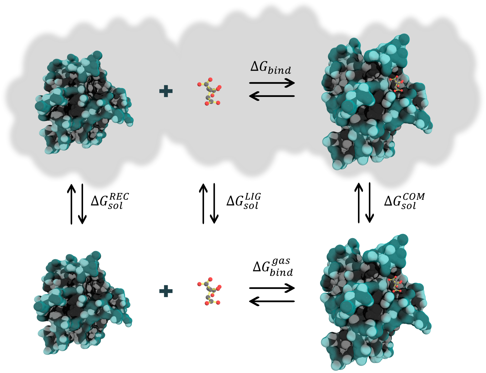

# Introduction

MM/PB(GB)SA method can be used for calculating binding free energies of non covalently bound complexes.

<figure markdown="1">
{ width=50% style="display: block; margin: 0 auto"}
  <figcaption markdown="1" style="margin-top:0;">
**Figure 1.** Thermodynamic cycle for binding free energy calculations
  </figcaption>
</figure>

[16]: ../assets/images/cycle.png

The free binding energy for a complex can be estimated as follows:

$$
∆𝐺_{bind} = 〈𝐺_{𝐶𝑂𝑀}〉−〈𝐺_{𝑅𝐸𝐶}〉−〈𝐺_{𝐿𝐼𝐺}〉
$$

    (1)

where each term to the right in the equation is given by:

$$
𝐺_{x} = 〈𝐸_{𝑀𝑀}〉 + 〈𝐺_{𝑠𝑜𝑙}〉 − 〈𝑇𝑆〉
$$

    (2)

In turn, $∆𝐺_{𝑏𝑖𝑛𝑑}$ can also be represented as:

$$
∆𝐺_{bind} = ∆𝐻 − 𝑇∆𝑆
$$

    (3)

where ∆𝐻 corresponds to the enthalpy of binding and −𝑇∆𝑆 to the conformational entropy after ligand binding. When the 
entropic term is dismissed, the computed value is the effective free energy, which is usually sufficient for 
comparing relative binding free energies of related ligands.

The ∆𝐻 can be decomposed into different terms:

$$
∆H_{bind} = ∆𝐸_{𝑀𝑀} + ∆𝐺_{𝑠𝑜𝑙}
$$

    (4)

where:

$$
∆𝐸_{𝑀𝑀} = ∆𝐸_{𝑏𝑜𝑛𝑑𝑒𝑑} + ∆𝐸_{𝑛𝑜𝑛𝑏𝑜𝑛𝑑𝑒𝑑} = (∆𝐸_{𝑏𝑜𝑛𝑑} + ∆𝐸_{𝑎𝑛𝑔𝑙𝑒} + ∆𝐸_{𝑑𝑖ℎ𝑒𝑑𝑟𝑎𝑙}) + (∆𝐸_{𝑒𝑙𝑒} + ∆𝐸_{𝑣𝑑𝑊})
$$

    (5)

The gas phase free energy contributions ($∆𝐸_{𝑀𝑀}$) are calculated by `sander` within the AmberTools package 
according to the force field used in the MD simulation. 

The $∆𝐺_{𝑠𝑜𝑙}$ is given by:

$$
∆𝐺_{𝑠𝑜𝑙} = ∆𝐺_{𝑝𝑜𝑙} + ∆𝐺_{𝑛𝑜𝑛𝑝𝑜𝑙} = ∆𝐺_{𝑃𝐵/𝐺𝐵} + ∆𝐺_{𝑛𝑜𝑛𝑝𝑜𝑙}
$$

    (6)

where:

$$
∆𝐺_{𝑛𝑜𝑛𝑝𝑜𝑙𝑎𝑟} = 𝑁𝑃_{𝑇𝐸𝑁𝑆𝐼𝑂𝑁} ∗ ∆𝑆𝐴𝑆𝐴 + 𝑁𝑃_{𝑂𝐹𝐹𝑆𝐸𝑇}
$$

    (7)

or,

$$
∆𝐺_{𝑛𝑜𝑛𝑝𝑜𝑙} = ∆𝐺_{𝑑𝑖𝑠𝑝} + ∆𝐺_{𝑐𝑎𝑣𝑖𝑡𝑦} = ∆𝐺_{𝑑𝑖𝑠𝑝} + (𝐶𝐴𝑉𝐼𝑇𝑌_{𝑇𝐸𝑁𝑆𝐼𝑂𝑁} ∗ ∆𝑆𝐴𝑆𝐴 + 𝐶𝐴𝑉𝐼𝑇𝑌_{𝑂𝐹𝐹𝑆𝐸𝑇})
$$

    (8)

In the above equations, $∆𝐸_{𝑀𝑀}$ corresponds to the molecular mechanical energy changes in the
gas phase. $∆𝐸_{𝑀𝑀}$ includes $∆𝐸_{𝑏𝑜𝑛𝑑𝑒𝑑}$, also known as internal energy, and 
$∆𝐸_{𝑛𝑜𝑛𝑏𝑜𝑛𝑑𝑒𝑑}$, corresponding to the van der Waals and electrostatic contributions. The solvation energy is 
determined differently, depending on the method employed. In the 3D-RISM model, both components -polar and non-polar- 
of the solvation energy are calculated. However, the PB and GB models estimate only the polar component of the 
solvation. The non-polar component is usually assumed to be proportional to the molecule's total solvent accessible 
surface area (SASA), with a proportionality constant derived from experimental solvation energies of small non-polar 
molecules (eq. 7). Alternatively, a modern approach that separates non-polar solvation free energies into cavity and 
dispersion terms can be used. In this approach, SASA is used to correlate the cavity term only, while a 
surface-integration method is employed to compute the dispersion term (eq. 8).

Furthermore, the entropic component is usually calculated by normal modes analysis (NMODE). The translational and
rotational entropies can be estimated using standard statistical mechanical formulas. Nevertheless, calculating 
vibrational entropy using normal modes is computationally expensive because it requires expanding the internal 
coordinate covariance matrix for all degrees of freedom for a set of minimized structures. Conversely, the 
Quasi-harmonic (QH) approximation is less computationally expensive, although it requires a considerable number of
frames to converge. Recently, other alternatives have been developed, such as NMODE in truncated systems, 
which considerably reduces the computational cost. Interaction Entropy (IE) is another novel method that 
calculates the entropic component of the binding free energy directly from MD simulations without any extra 
computational cost. This method is numerically reliable, more computationally efficient, and superior to the 
standard NMODE approach, as shown in an extensive study of over a dozen randomly selected protein-ligand binding 
systems.

Typically, two approaches are used for MM/PB(GB)SA calculations, known as Single Trajectory Protocol (STP) and 
Multiple Trajectory Protocol (MTP). In STP, both the receptor and the ligand trajectories are extracted 
from that of the complex. This approach is valid when the bound and unbound states of the receptor, and the ligand 
are similar. It is computationally less expensive than the MTP approach since only a simulation of the complex is 
required. Additionally, the potential internal terms (_e.g._, bonds, angles, and dihedrals) cancel exactly in STP 
since these terms are the same in both bound and unbound states. On the other hand, the MTP is a more realistic 
approach because it considers multiple trajectories (_i.e._, complex, receptor, and ligand). However, significant 
conformational changes can lead to numerous errors. In practice, a detailed study of the system is required to 
select the approach to be used.

## Literature
Further information can be found in [Amber manual][3]:

* [MMPBSA.py][4]
* [The Generalized Born/Surface Area Model][5]
* [PBSA][6]
* [Reference Interaction Site Model][7]
* [Generalized Born (GB) for QM/MM calculations][8]

and the foundational papers:

* [Srinivasan J. et al., 1998][9] 
* [Kollman P. A. et al., 2000][10] 
* [Gohlke H., Case D. A. 2004][11] 

as well as some reviews and expert opinions:

* [Genheden S., Ryde U. 2015][12] 
* [Wang et. al., 2018][13]  
* [Wang et. al., 2019][14]
* [Tuccinardi, 2021][16]

  [1]: https://pubs.acs.org/doi/10.1021/ct300418h
  [2]: https://pubs.acs.org/doi/abs/10.1021/jacs.6b02682

  [3]: https://ambermd.org/doc12/Amber21.pdf
  [4]: https://ambermd.org/doc12/Amber21.pdf#chapter.36
  [5]: https://ambermd.org/doc12/Amber21.pdf#chapter.4
  [6]: https://ambermd.org/doc12/Amber21.pdf#chapter.6
  [7]: https://ambermd.org/doc12/Amber21.pdf#chapter.7
  [8]: https://ambermd.org/doc12/Amber21.pdf#subsection.11.1.3
  [9]: https://pubs.acs.org/doi/abs/10.1021/ja981844+
  [10]: https://pubs.acs.org/doi/abs/10.1021/ar000033j
  [11]: https://onlinelibrary.wiley.com/doi/abs/10.1002/jcc.10379
  [12]: https://www.tandfonline.com/doi/full/10.1517/17460441.2015.1032936
  [13]: https://www.frontiersin.org/articles/10.3389/fmolb.2017.00087/full
  [14]: https://pubs.acs.org/doi/abs/10.1021/acs.chemrev.9b00055
  [15]: https://pubs.acs.org/doi/full/10.1021/acs.jctc.8b00418
  [16]: https://www.tandfonline.com/doi/pdf/10.1080/17460441.2021.1942836