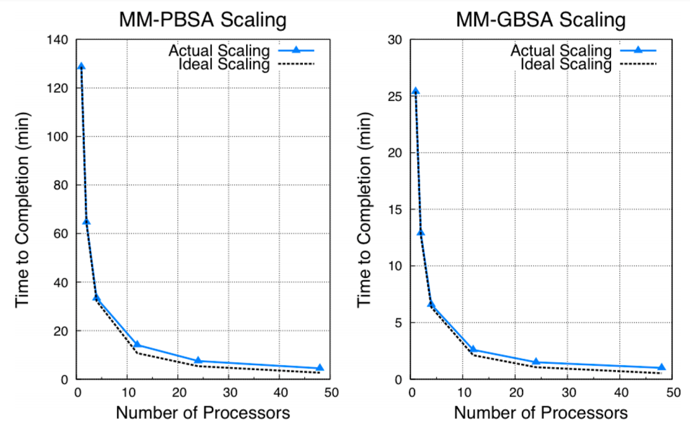

## Before any calculations

**xBFreE** requires minimum processing on the input structure and trajectory files. Before running any MMPBSA 
calculation, please make sure:

??? tip "The structure defined in `-cs`, `-rs`, or `-ls` options is consistent"
        
    Visualize the structure contained in the structure input file given in the `-cs`, `-rs`, or `-ls` 
    options and make sure it is consistent (as shown in Fig 1, right panel). On the other hand, if the 
    structure is "broken" (as shown in Fig 1, left panel) this could generate inconsistent results.
    
    _Generate the structure from tpr file:_
        
        gmx editconf -f md.tpr -o md.pdb
    
    <figure markdown="1">
    [![overview][4]][4]
      <figcaption markdown="1" style="margin-top:0;">
    **Figure 1.** Vizualization of two different input structures files. Left: "Broken" structure; Right: Centered structure 
      </figcaption>
    </figure>

[4]: ../assets/images/q_a/inconsistent_str.png

??? tip "The trajectory defined in `-ct`, `-rt`, or `-lt` doesn't contain PBC"

    Visualize the trajectory given in the `-ct`, `-rt`, or `-lt` options and make sure the PBC has been 
    removed (as shown in Fig 2, right panel). On the other hand, if the trajectory has not been fitted (as 
    shown in Fig 2, left panel) this could generate inconsistent results.
    
    Steps:

    1. Generate a group that contains both molecules
        
            gmx make_ndx -n index.ndx
    
            >1 | 12
    
            >q

        _Assuming 1 is the receptor and 12 is the ligand. This creates a new group (number 20 in this example)_
    
    2. remove the PBC
        
            gmx trjconv -s md.tpr -f md.xtc -o md_noPBC.xtc -pbc mol -center -n -ur compact
            center: 20 (created group)
            output: 0
    
    3. remove the rotation and translation with respect to the reference structure (optional)
        
            gmx trjconv -s md.tpr -f md_noPBC.xtc -o md_fit.xtc -n -fit rot+trans
            fit: 20 (created group)
            output: 0
        
    4. Visualization
        
        Make sure that the trajectory is consistent (as shown in Fig 2, right panel)

    5. If the process is not succesful, consider using other options like `-pbc nojump` (as suggested [here][5])

    <figure markdown="1">
    [![overview][3]][3]
      <figcaption markdown="1" style="margin-top:0;">
    **Figure 2.** Vizualization of two different input trajectory files. Left: Trajectory with PBC; 
    Right: Trajectory centered, fitted and with PBC removed.
      </figcaption>
    </figure>

[3]: ../assets/images/q_a/traj_comp.gif
[5]: https://github.com/Valdes-Tresanco-MS/gmx_MMPBSA/issues/353

## Running MMPBSA calculations

!!! tip
    **We currently recommend the use of MPI since the computation time decreases considerably.**

=== "Parallel (MPI) version"
    **xBFreE** uses the `MPI` only to perform the calculations, the rest of the process (_i.e_, 
    Generation/conversion of Amber topologies, mutation, division of the trajectories, etc.) occurs in a single 
    thread (See **Figure 3** for better reference). This means that it is not necessary to install any program 
    (AmberTools or GROMACS) with `MPI`, which can be used in any circumstance, and the time required to process the 
    data prior to the calculation depends on the system and will be the same for both versions (`Serial` and `MPI`). 

    
    ???+ tip "Remember" 
        Make sure that you have OpenMPI available in your computer

    A usage example is shown below:

    === "Local"
    
            mpirun -np 2 xbfree gmx_MMPBSA -O -i mmpbsa.in -cs com.tpr -ci index.ndx -cg 1 13 -ct com_traj.xtc
    
    === "HPC"
    
            #!/bin/sh
            #PBS -N nmode
            #PBS -o nmode.out
            #PBS -e nmode.err
            #PBS -m abe
            #PBS -M email@domain.edu
            #PBS -q brute
            #PBS -l nodes=1:surg:ppn=3
            #PBS -l pmem=1450mb or > 5gb for nmode calculation
            
            cd $PBS_O_WORKDIR
            
            mpirun -np 3 xbfree gmx_MMPBSA -O -i mmpbsa.in -cs com.tpr -ci index.ndx -cg 1 13 -ct com_traj.xtc > progress.log

    
    !!! danger
        Unfortunately, when running `xbfree gmx_MMPBSA` with `MPI`, GROMACS's `gmx_mpi` can't be used. This is probably 
        because of `gmx_mpi` conflicts with mpirun. In any case, this is not a problem since `gmx` works correctly 
        and `gmx_mpi` only parallels `mdrun`, the rest of the GROMACS tools work in a single thread. See this 
        [issue](https://github.com/Valdes-Tresanco-MS/gmx_MMPBSA/issues/26) to see the output.

    !!! warning
        The nmode calculations require a considerable amount of RAM. Consider that the total amount of RAM will be:

        RAM~total~ = RAM~1_frame~ * NUM of Threads
        
        If it consumes all the RAM of the system it can cause crashes, instability or system shutdown!
        

    !!! note
        At a certain level, running RISM in parallel may actually hurt performance, since previous solutions are used 
        as an initial guess for the next frame, hastening convergence. Running in parallel loses this advantage. Also, 
        due to the overhead involved in which each thread is required to load every topology file when calculating 
        energies, parallel scaling will begin to fall off as the number of threads reaches the number of frames. 

=== "Serial version"
    This version is installed via pip as described above. `AMBERHOME` variable must be set, or it will quit with an error. 
    An example command-line call is shown below:
    
        gmx_MMPBSA -O -i mmpbsa.in -cs com.tpr -ci index.ndx -cg 1 13 -ct com_traj.xtc
    
    You can found test files on [GitHub][1]

  [1]: https://github.com/Valdes-Tresanco-MS/gmx_MMPBSA/tree/master/docs/examples

<figure markdown="1">
{ width=70% style="display: block; margin: 0 auto"}
  <figcaption markdown="1" style="margin-top:0;">
  **Figure 3**. **`MPI` benchmark description from <a href="https://pubs.acs.org/doi/10.1021/ct300418h">MMPBSA.py 
paper</a>.**
  `MMPBSA.py` scaling comparison for `MM-PBSA` and `MM-GBSA` calculations on 200 frames of a 5910-atom complex. Times 
  shown are the times required for the calculation to finish. Note that `MM-GBSA` calculations are ∼5 times faster 
  than `MM-PBSA` calculations. All calculations were performed on NICS Keeneland (2 Intel Westmere 6-core CPUs per 
  node, QDR infiniband interconnect) 
  </figcaption>
</figure>

[2]: ../assets/images/mmpbsa_py_mpi.png