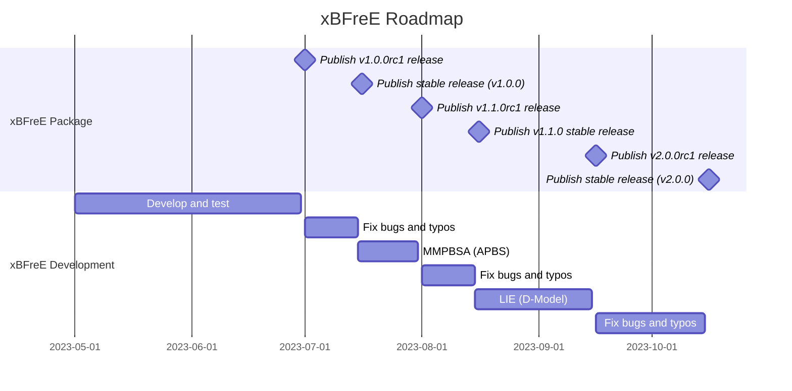

# Roadmap
Our roadmap prioritizes the implementation of widely used methods. Currently, we have successfully implemented 
gmx_MMPBSA, which incorporates several methods derived from PB and other implicit solvent-based approaches. 
However, our future plans involve expanding our method offerings to include additional approaches such as 
LIE, FEP, and TI.

!!! important
    Please note that our roadmap is subject to change and should be considered tentative. We cannot guarantee exact 
    timelines as we currently lack financial resources and can only dedicate our free time to project development. 
    However, we encourage you to consider becoming a sponsor to support our efforts. By becoming a sponsor, we can 
    aim for full-time development and provide more accurate release dates in the future. For more information on 
    sponsorship opportunities, please visit [becoming a sponsor](../../sponsor#how-to-become-a-sponsor).

