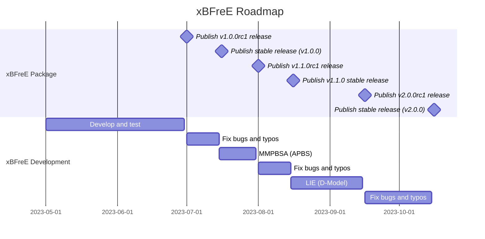

# Roadmap
Our roadmap focuses on first implementing methods that are widely used. Initially, starting with gmx_MMPBSA, we 
implemented most of the methods derived from PB. However, in the future, we want to implement several more methods, 
like LIE, FEP, and TI.

!!! important
    It is important to clarify that our roadmap is tentative but does not guarantee that it is exact. As we mentioned, 
    we do not have financing, so we can only dedicate our free time to the project development. If possible, 
    consider [becoming a sponsor](../../sponsor#how-to-become-a-sponsor). Shortly, we plan to apply for financing that 
    will allow full-time development and therefore have more exact release dates.   

